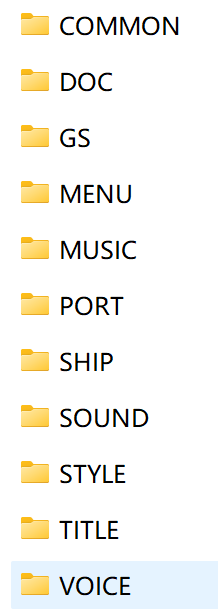

# 这个项目是ATC4的非官方文档
# 关于游戏目录

图里面的都是**一般会用**的文件夹（来自XJATC版）
- COMMON
    - CURSOR
        - 游戏需要的光标
    - FONT
        - 游戏需要的字体，和字体的许可协议
    - SOUND
        - 游戏需要的音效
    - TPS:这里面的东西比较杂，一般不用动
- DOC
    - 游戏启动后右上角的更新日志
- GS
    - 游戏的游戏的脚本文件文件，配置文件，和杂七杂八的
- MENU
    - AML 
    - SOUND
        - 音效
    - STYLE
    - 菜单的文件
- MUSIC
    - 游戏的音乐
- PORT
    - cloud
        - 云的图
    - Loader
        - 加载的进度条什么的
    - moon
        - 月亮的图
    - rain
        - 关于雨
    - star
        - 关于星星
    - sun
        - 关于太阳
    - Weather
        - 天气
    - 游戏机场（例如中部国际/RJGG）
        - TPS:这里只提改档一般需要的
        -
        - 游戏内的地图
    - 游戏机场（游戏内的地图）和天气什么的
- SHIP
    - 游戏的飞机模型
- SOUND
    - 游戏的音效
- STYLE
    - 游戏莫些贴图
- TITLE
    - 游戏的标题画面，标题音效，标题配置等
- VOICE
    - ATC
        - ATC和飞行员的语音
    - OTHERS
        - ES
            - ES关卡的对话
        - 特别的语音
    - error.wav
        -大功臣 游戏找不到管制官或者飞行员的语音时会替换成它
    - 游戏的语音配置