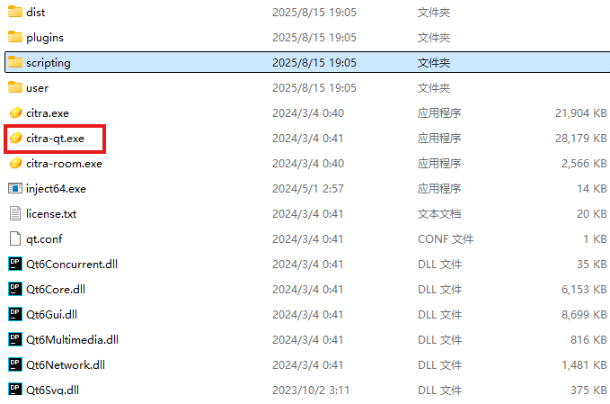
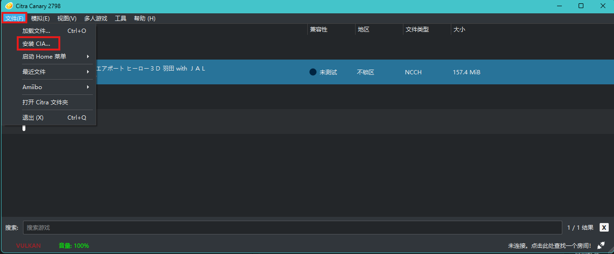

1. 我们先安装`Citra`模拟器
    1. 直接下载解压，这一步可以上[b站视频](https://www.bilibili.com/video/BV1xZ4y1v7pU)学习
2. 然后点击目录下的`citra-qt.exe`打开

3. 最后我们安装`3DS AirPort Haro`
    1. 直接下载解压
    2. 
    点击`文件`->`安装CIA`，选择你提前解压好的CLA就可以了
    3. 启动游戏
    > 值得注意的是这游戏支持手柄，没有手柄玩的难受