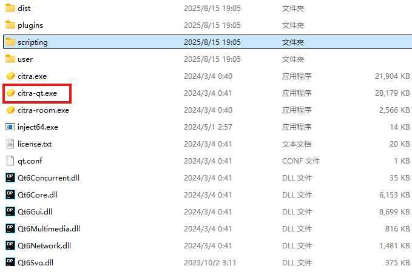
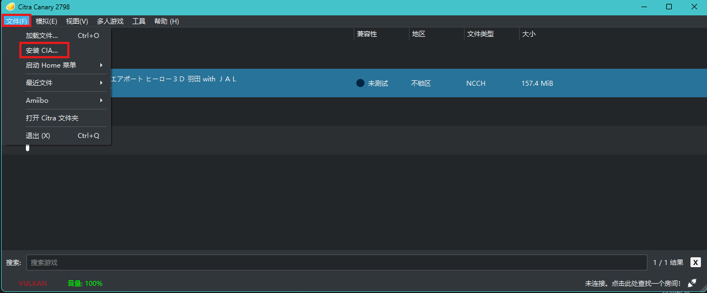

1. First, install the `Citra` emulator.
    1. Download and extract it directly. You can follow the [Bilibili video](https://www.bilibili.com/video/BV1xZ4y1v7pU) for this step.
2. Then click `citra-qt.exe` in the folder to open it.

3. Finally, install `3DS AirPort Haro`.
    1. Download and extract it directly.
    2. Click `File` -> `Install CIA`, then select the CIA file you extracted earlier.

    

    3. Start the game.

    > Note that this game supports controllers. Playing without a controller is uncomfortable.
