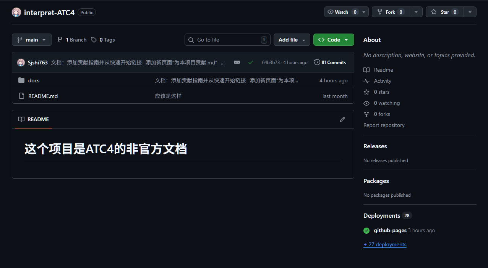
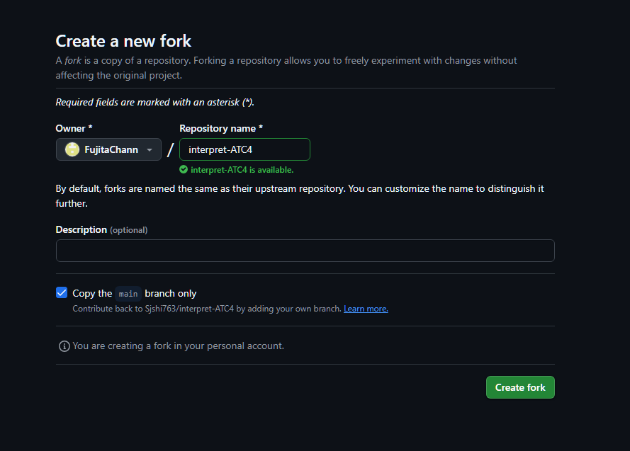
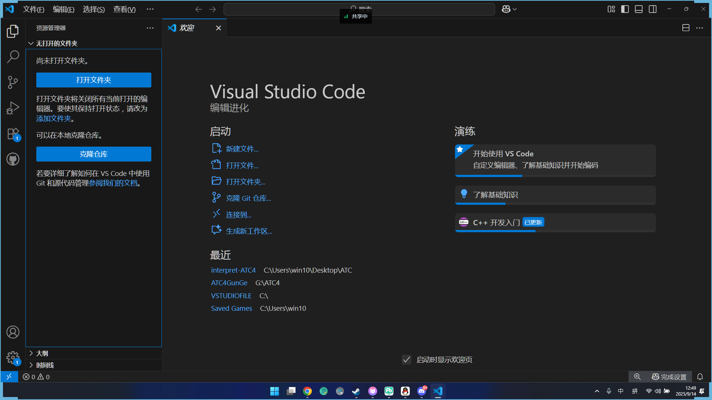
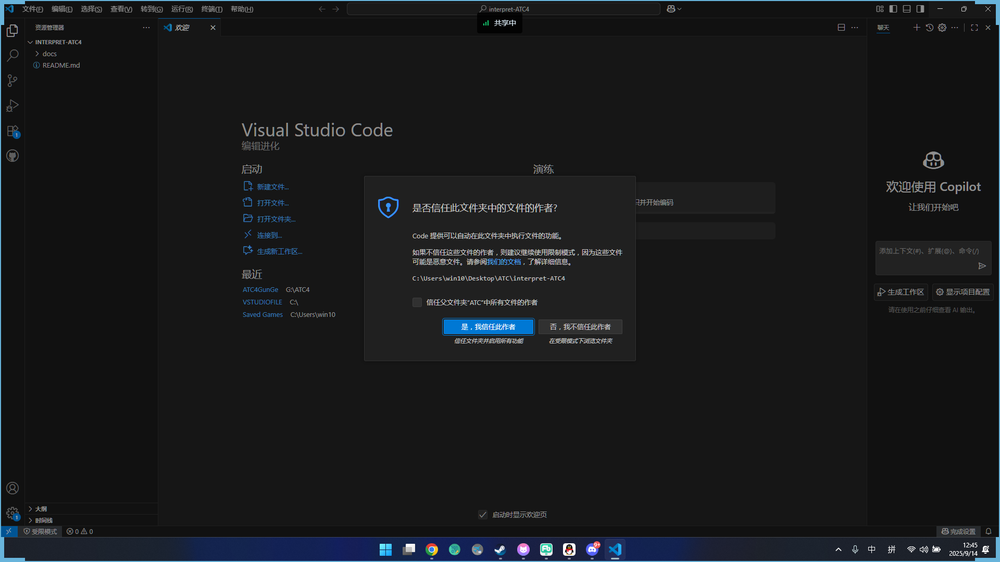
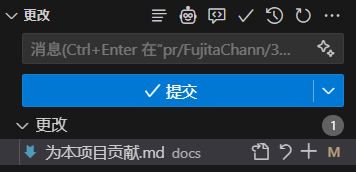
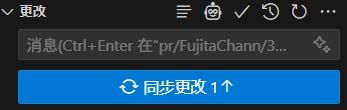
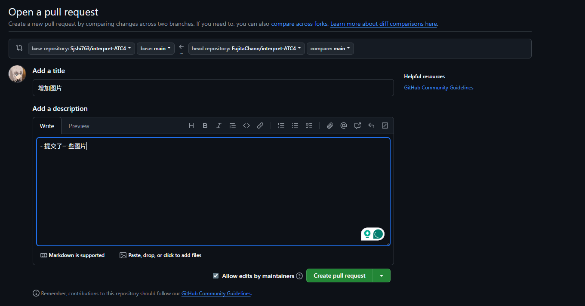
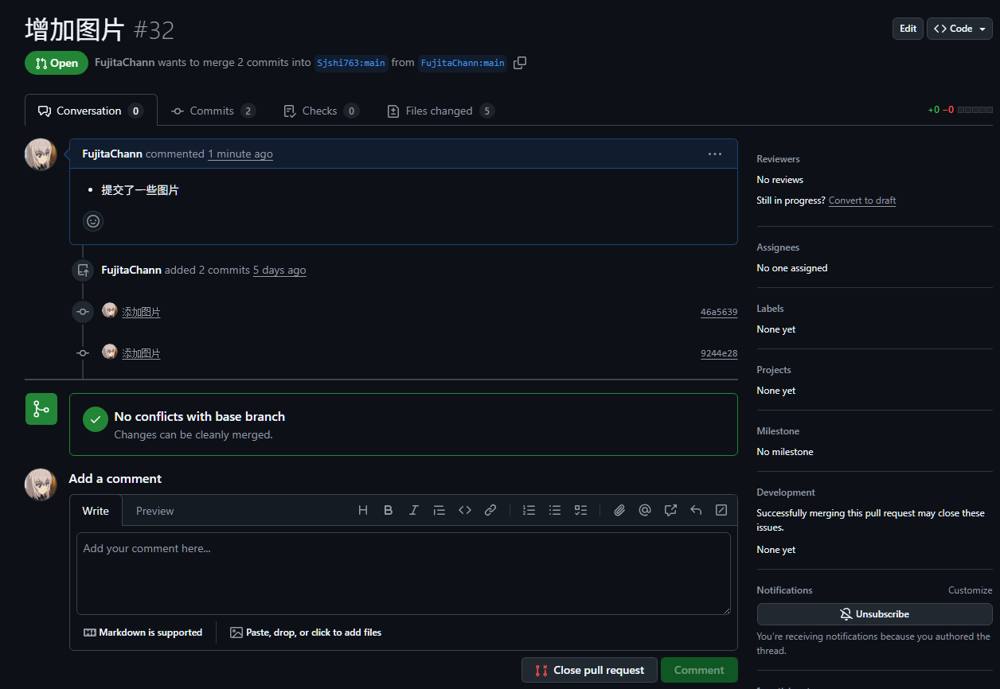

# Contributing to This Project

If you want to contribute solutions to this project, please submit a PR. This page explains how to submit one.

To avoid duplicate work and make sure others know what is being changed, please discuss any change in an issue before you start.

- Required environment
    1. Make sure Git is installed and configured.
    2. Have a valid GitHub account.
    3. Install any IDE. VSCode is recommended.
- Optional but helpful
    1. Install npm.
    2. Know how to use a terminal.

1. First, fork this project.

Click the `Fork` button.

2. Edit the fork details.

3. Then clone your fork locally.
    1. Open VSCode.
    2. Click clone repository.

    

    3. Choose whether to trust this repository.

    

4. Make your changes and save them.

5. Create a commit.

6. Push your local changes.

7. Start submitting the PR.

8. Wait for review. If changes are requested, update the PR in time.

Done. Your contribution has been merged into the main project. [#30](https://github.com/Sjshi763/interpret-ATC4/issues/30) is one example of contributing to this project. Thank you for your contribution.
