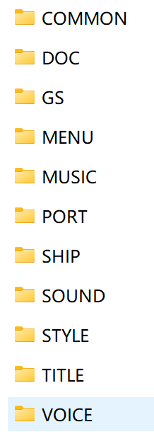

# Game Directories

The directories shown in the image are folders that are generally used. This is based on the XJATC version.

- COMMON
    - CURSOR
        - Cursors needed by the game
    - FONT
        - Fonts needed by the game and their license agreements
    - SOUND
        - Sound effects needed by the game
    - TPS
        - Mixed files. Usually you do not need to change anything here.
- DOC
    - Changelog shown in the upper-right corner after the game starts
- GS
    - Game script files, configuration files, and various other files
- MENU
    - AML
    - SOUND
        - Sound effects
    - STYLE
    - Menu files
- MUSIC
    - Game music
- PORT
    - cloud
        - Cloud images
    - Loader
        - Loading progress bar and related files
    - moon
        - Moon images
    - rain
        - Rain-related files
    - star
        - Star-related files
    - sun
        - Sun-related files
    - Weather
        - Weather
    - Game airport, such as Chubu Centrair International Airport/RJGG
        - APL
            - AieportAction
                - Adjustable jet bridge actions and similar behavior
                - apl.ini
            - Camera
                - HeightCheck
                    - Collision volume model for the free-camera view
                    - collision_map.pvm
                - fixed.ini
                    - Collision volume model for the free-camera view
            - MiscObject
                - MiscObject.ini
                    - Scene model configuration file
                - Car
                    - Mdl_ParkedCar
                        - Built-in scene model folder
                        - ...
                    - point_gse_01.pnt
                        - Scene model placement point file
                    - route_apron_22.pnt
                        - Scene model route file
                    - ...
                - Custom Folder
                    - Custom model files
                    - dll
                        - DLL files
                    - Mdl
                        - Model folder
                    - xxxx.pnt
                        - Scene model placement point file
            - VoiceActManager
                - Voice files related to ATC and crew dialogue
        - GROUND
            - radar.bmp
                - Radar image
            - pushback.csv
                - Apron pushback routes
            - taxi.csv
                - Taxi routes
        - MODEL
            - ACTION
                - Pbb_1_??m
                    - Jet bridge model reference
                - Wdi1  Asr
                    - Windsock and similar model references
                - ...
            - SHARE1/2/3
                - DXT3.dds
                    - Texture
            - dnsea.pvm
                - Sea model
            - Light_Parent.pvm
                - Runway light model
            - rjaa_h1.pvm
                - Airport model
            - PAPI.ini
                - PAPI settings. The angle can be adjusted.
            - ...
        - RADAR
            - radar.bmp
                - Radar image
            - fix.ini
                - Waypoint positions, or aircraft spawn points
        - ROUTE
            - AP_LDA_W_RWY22_BACON.ard
                - Route
            - ...
        - SCENARIO
            - Custom Stage
                - Custom stage
                - 001001_Stage01
                    - Stage08.snax
                        - Stage file
                    - stage08.xmtx
                        - Special event. Optional.
                    - insertcut_stage07.ini
                        - Special event text. Optional.
                    - music.inix
                        - Music file, referencing a `wvt` file from MUSIC
                    - stage.ini
                        - Stage description text
                - 001002_Stage02
                    - Basically similar
                - APL
                    - VoiceActManager
                        - Voice files related to ATC and crew dialogue. Optional.
                    - ...
                - APLdata
                    - GROUND
                        - Pushback and taxi files, etc. Optional.
                    - CAMERA
                        - Camera points, etc. Optional.
                    - ...
                - command932.defx
                    - Command file. Optional.
                - state932.defx
                    - State file. Optional.
                - RouteTable.ini
                    - Route assignment file. Optional.
                - schedule.ini
                    - Stage description text. Optional.
                - image_stage.dds
                    - Stage selection background image. Optional.
                - thumbnail.bmp
                    - Stage preview image. Optional.
                - port.ini
                    - Airport information. Optional.
            - 0010_Stage_01
                - Official stage
            - command932.defx
                - Command file
            - state932.defx
                - State file
            - RouteTable.ini
                - Route assignment file
        - SHIP
            - a4_A359_SIA
                - Aircraft model
            - ...
        - VOICE
            - Voice files related to ATC and crew dialogue
        - port.ini
            - Airport information
    - Game airport, meaning the in-game map, weather, and related files
- SHIP
    - Aircraft models used by the game
- SOUND
    - Game sound effects
- STYLE
    - Some game textures
- TITLE
    - Game title screen, title sound effects, title configuration, and related files
- VOICE
    - ATC
        - Voices for ATC and pilots
    - OTHERS
        - ES
            - Dialogue for ES stages
        - Special voices
    - error.wav
        - A major contributor. When the game cannot find a controller or pilot voice, it uses this file as a replacement.
    - Game voice configuration

