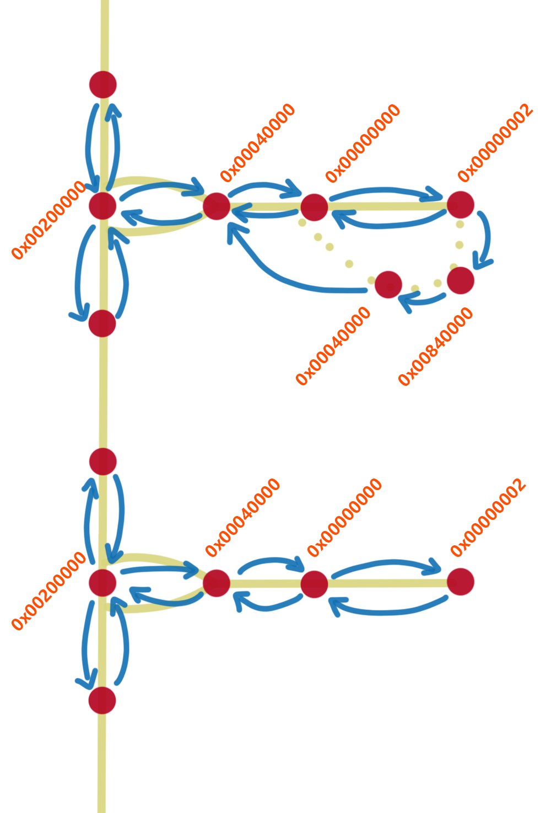
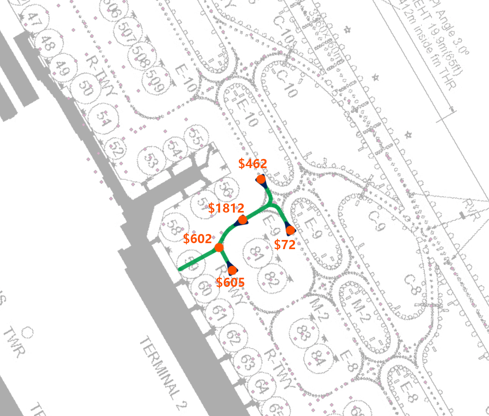

# Taxi and Pushback Routes

## taxi.csv

This file is located in `ATC4\PORT\Rxxx\GROUND`. Any change to it affects all stages.

| Point ID | Name | Unknown | Route selection point | X coordinate | Z coordinate | Point attribute | Adjacent point | Adjacent point | Adjacent point | Adjacent point |
|----|----|----|----|----|----|----|----|----|----|----|
|2502|_NoName|1|0|369.683|1305.92|0x00080000|93|92|||
|2503|_NoName|1|0|1929.88|-3154.16|0x00080000|174|175|||
|2505|_NoName|1|0|2310.85|-2755.72|0x00000000|2483|179|||
|2506|_NoName|1|0|3261.93|-1684|0x00080000|1178|1177|||
|2509|_NoName|1|0|284.286|-1339.88|0x00080000|336|27|2510||
|388|D3|1|1|2165.99|-2934.08|0x80020001|389|387||||
|389||1|0|2214.19|-2913.83|0x80000000|388|391||||
|2482|D4|1|1|2214.19|-2792.81|0x80020001|2485|||||
|1170|D5|1|1|2315.49|-2720.05|0x80020001|1172|1169||||
|1179|D6|1|1|3313.63|-1730.98|0x80020001|1180|1178||||
|325|D7|1|1|1341.69|-1372.36|0x80020001|328|324||||

Point attributes:

```ini
0x00000000 = Normal point
0x00000002 = Apron
0x00840000 = Self-taxi point
0x00040000 = Point that appears in the middle of the apron. Its purpose is unclear.
0x00200000 = Connection point between taxiway and apron
```



Point attributes and connection relationships for stands. Top: self-taxi stand. Bottom: normal stand.

| Point attribute | Description |
|--|--|
|0x00008000|High-speed taxiway. Taxi speed can reach 28 kt.|
|0x00200000|Apron entrance. Connection point between apron and taxiway.|
|0x00040000|Meaning unclear. Appears near apron entrances.|
|0x00000000|Regular taxiway. Taxi speed is 20 kt.|
|0x00010004|Taxiway start point on the runway, used for rapid exits.|
|0x00000004|Taxiway start/end point on the runway, used for perpendicular exits.|
|0x80000011|Meaning unclear.|
|0x80020001|Runway entrance/exit holding point.|
|0x00020000|Meaning unclear. Appears near holding points. Possibly used to announce holding point names.|
|0x80008011|Meaning unclear.|
|0x80000000|Meaning unclear. Appears near Narita GWY.|
|0x00028000|Meaning unclear. Appears before GPHOLD.|
|0x00088000|GPHOLD holding point.|
|0x80020211|GWY holding point.|
|0x00000002|Apron.|

Table organized by RZD.

## pushback.csv

This file is located in `ATC4\PORT\Rxxx\GROUND`. Any change to it affects all stages. It manages pushback routes for parking stands.

> Although this is a CSV file, do not edit it with Excel.

```csv
SPOT59
,RWY05,[heading_north,$602,$605,],[*heading_west,$602,$1812,],[*heading_south,$602,$462,],[heading_north,$602,$72,]
,RWY22,[heading_north,$602,$605,],[*heading_west,$602,$1812,],[*heading_south,$602,$462,],[heading_north,$602,$72,]
,RWY04,[heading_north,$602,$605,],[*heading_west,$602,$1812,],[*heading_south,$602,$462,],[heading_north,$602,$72,]
,RWY16L,[heading_north,$602,$605,],[heading_west,$602,$1812,],[*heading_south,$602,$462,],[heading_north,$602,$72,]
,RWY16R,[heading_north,$602,$605,],[heading_west,$602,$1812,],[*heading_south,$602,$462,],[heading_north,$602,$72,]
,RWY34L,[heading_north,$602,$605,],[*heading_west,$602,$1812,],[*heading_south,$602,$462,],[heading_north,$602,$72,]
,RWY34R,[heading_north,$602,$605,],[*heading_west,$602,$1812,],[*heading_south,$602,$462,],[heading_north,$602,$72,]
```

SPOT??

```text
,runway,[heading,start point,end point,],[heading,start point,end point,]
```

Add a `$` before each point number.

Choose `0x00200000`, the connection point between taxiway and apron, as the start point.



## How to Make Routes

The steps are the same as route making. Replace the base map with a ground chart, find known points in `ROUTE` as control points, import control point coordinates directly from `taxi.csv`, then follow the remaining steps. In the end, you can obtain taxi point coordinates.

> Add a reference here after this section is finished.
