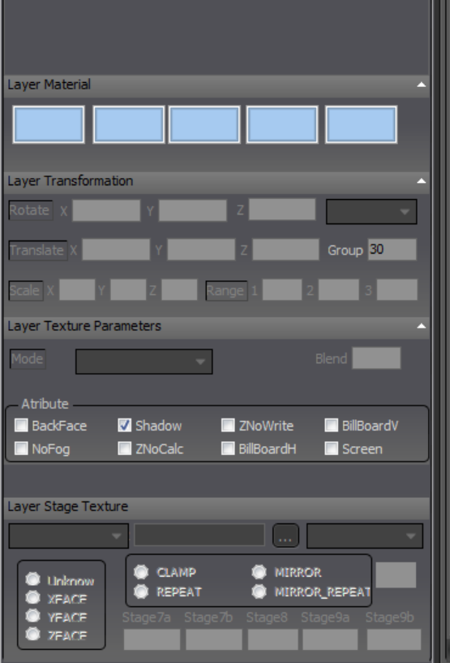

# Models
## PVM Format
The ```.pvm``` format is the only model file format readable by ATC4 and can be edited with `PVM Editor`.
File content example (opened with VS Code):
```
Layer("jacket_leg2_h"){
Material(#00E8E8E8,#00000000,0,#00A0A0A0,#00000000)
Mode("TEXTURE1")
Group(2)
Stage("NORMAL_SHADE","@d_rwy_jacket_01.dds",0,"REPEAT","MIPMAPANISOTROPIC","Unknown")
Face(2,1,0)
Face(0,1,3)
...
Vertex([0.70009,-16.4,0.70004],[0.69636,0.17365,0.69636],[0.21093,0.71094])
Vertex([0.70009,-6.4,-0.69997],[0.69636,0.17365,-0.69636],[0.11718,0.39844])
...
}
···
"jacket_leg2_h": Component name
Mode("TEXTURE1"): Single texture
Mode("TEXTURE2"): Two textures
Group(2): Rendering layer
Stage("NORMAL_SHADE","oasis_02.bmp",0,"REPEAT","LINEAR","Unknown")
NORMAL_SHADE texture mode
oasis_02.bmp Texture (only 24-bit .bmp or DXT3 .dds are supported)
REPEAT: Repeat
Face: Face
Vertex: Vertex
```


> For specific content, refer to PVM Editor.

### Regarding Rendering Layers Group
Description in ```ATC4\PORT\RJTT\port.ini```
```ini
[RENDER]
sea=1,2,3
ground=4,5,6,7,8,10,11,12,13,14,15,16,17,18,19
building=20,21,22,23,24,25,26,27,28
```
For specific rendering layers, see the image below.

## MODEL
Models for the airport and surrounding terrain, located in `ATC4\PORT\Rxxx\MODEL`.

> To be referenced by someone in the future.

## MiscObject
Responsible for models of vehicles in parking lots, trams, monorails, ships at sea, etc., located in `ATC4\PORT\Rxxx\APL\MiscObject`.
```ini
[COLORPOWER]
Night=120
Light=130

[OBJECT_INFO]
ANCHORING=3   ;Number of static models
MOVING=3      ;Number of moving models
MOVING_MINIMUM=0

;//----parkedCar-24Hours---------------------------//

[ANCHORING_00]
name=parkedCar_01
density=30
model_00=Car\Mdl_ParkedCar_nl\  ;Folder for the .pvm model file
modelActDir=Car\dll\
modelActFile=Car.uact
pointFile=4
point00=Car\point_parkingcar_01.pnt   ;Path to the model's point file
timeAppear=06:00       ;Appearance time, optional
timeDisappear=22:00    ;Disappearance time, optional
restDisappear=10

[ANCHORING_01]
name=parkedCar_02
density=30
model_00=Car\Mdl_ParkedCar_nl\
modelActDir=Car\dll\
modelActFile=Car.uact
pointFile=4
point01=Car\point_parkingcar_02.pnt
timeAppear=06:00
timeDisappear=22:00
restDisappear=10

[ANCHORING_02]
name=parkedCar_03
density=30
model_00=Car\Mdl_ParkedCar_nl\
modelActDir=Car\dll\
modelActFile=Car.uact
pointFile=4
point02=Car\point_parkingcar_03.pnt
timeAppear=06:00
timeDisappear=22:00
restDisappear=10
```
Point file ```point_XXXX.pnt```
```ini
[HEADER]
count=723
[POINT]
36.6261,0,-25.0826,240.7102,RANDOM,
39.0518,0,-18.8279,59.9935,RANDOM,
X,Y,Z,Heading,Filename(can be random),
X,Y,Z,Heading,Filename(can be random),
