# Route Making
## Route File Related
All route files are placed in the ```ATC4\PORT\ICAO\ROUTE``` folder.
### aad
AA_RDR_xxx.aad
Radar guidance area.
AA_DIR_xxx.aad
Allows direct flight to a certain point after the aircraft enters this area.
```ini
[HEADER]
name=AA_RDR_CREAM_PMS
x=139:46:52
z=35:33:12
staff=
comment=
count=5
[POINT]
30042.04,914.40,-7544.51,0,
50771.75,914.40,-50390.96,0,
69267.18,914.40,-41323.79,0,
44021.00,914.40,10245.25,0,
34406.99,914.40,5509.01,0,
```
```ini
[HEADER]
Name: Name
x,z: Airport Reference Point (ARP) latitude and longitude coordinates (degrees:minutes:seconds)
count: Number of coordinate points in [POINT]
[POINT]
X coordinate, arrow pointing altitude, Z coordinate, speed,
X,Y,Z,Speed,
...
Forms a polygonal radar guidance area by connecting points in order.
Coordinates are relative to ARP.
All coordinates and altitudes are in meters.
Speed is in knots.
```
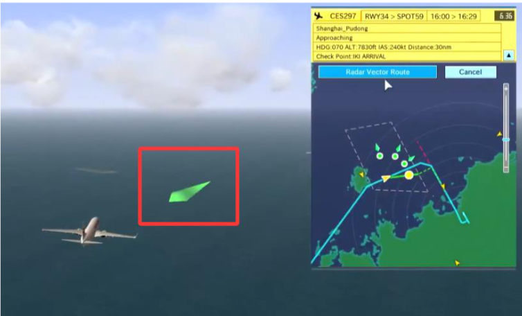
> The arrow pointing altitude is irrelevant to flight and only affects the direction of the green arrow.

> FINAL

If the radar guidance area directly leads to the final approach, add this parameter.
```
x,y,z,spd,   (Point 1, relative to远离 the runway)
x,y,z,spd,    (Point 2, relative to靠近 the runway)
```
Like this (only for demonstration, don't copy-paste directly)
```ini
[HEADER]
name=AA_RDR_SHINO
x=136:48:19
z=34:51:30
staff=
comment=
count=5
[FINAL]
-11096.00,1500.00,85778.00,0,
-27736,883.92,69877,0
[POINT]
-13104,914.4,84725,0,
-3643,914.4,65988,0,
-35251,914.4,45614,0,
-40088,914.4,52006,0,
-30641,914.4,772560,0,
```
### ard
```ini
[HEADER]
name=AR_OSHIMA1A_ARR
display=OSHIMA_1A_arrival
x=139:46:52
z=35:33:12
staff=
comment=
count=11
[RADAR]
direction=40,80,120,160,200,280,320,360
area=AA_RDR_WEDGE_PMS
areadistance=3000
areaaltft=10000
[POINT]
-33246.47,4572.00,-93547.95,0,OSHIMA@R2@Y3
-20463.39,4267.20,-86369.24,0,
-7680.32,3962.40,-79190.54,0,ANZAC
352.21,3962.40,-74705.11,0,TT450@Y2
16158.63,3962.40,-79561.91,0,TT451
28883.24,3962.40,-77819.37,0,TT452
40098.38,3962.40,-71476.62,0,WANDA@R0@Y0
33920.11,3200.40,-51413.39,0,
17975.49,2438.40,-44846.58,0,WEDGE@J@X1
18309.56,1828.80,-32956.59,0,ARLON@D
```
```ini
[HEADER]
Name: Name
Display: Content displayed in the game (use ルート)
```
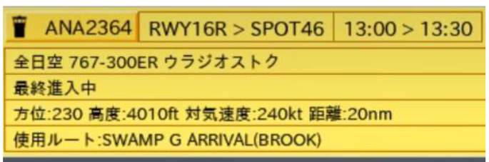
```ini
x,z: Airport Reference Point (ARP) latitude and longitude coordinates (degrees:minutes:seconds)
count: Number of coordinate points in [POINT]
[RADAR]
Radar guidance, optional content.
Direction: Optional guidance courses (magnetic heading).
Area: Name of the radar guidance area to call (aad file).
Areadistance: ?
Arealaltft: Flight altitude after radar guidance.
```
[POINT]
X coordinate, altitude, Z coordinate, speed (0 for no speed limit), waypoint name```@ROUTE_MARKER``` ```ROUTE_MARKER```'s function may vary per airport, specific functions are written in the state file. Generally, @D creates a direct flight point, @L is the landing gear down position, @J is the final direct flight point for radar guidance.
```Ini
;------------------------------------------------------------------------------------------------------------------------------------------------------
; Aircraft in flight (Approach section)
[APPROACH_APP:Approaching:飛行中]
  {($SHIP_FLAG_RADARVECTOR == 1) && ($SHIP_GOAROUNDED == 0)} <RADARVECTOR_SELECT>
  {($SHIP_FLAG_RADARVECTOR == 1) && ($SHIP_GOAROUNDED == 0) && ($USERFLAG01 == 1)} <FINALAPPROACH>
  {($SHIP_FLAG_RWYCHANGE == 1) && ($USERFLAG04 == 0)} <RUNWAY_SELECT_ALL>
  {($ROUTE_MARKER_R == 1) && ($USERFLAG04 == 0) && ($SHIP_GOAROUNDED == 1)} <RUNWAY_SELECT_GA>
  {($SHIP_LOCKIAS == 0) && ($USERFLAG15 == 1) && ($SHIP_ALT > 3000) && ($SHIP_ALT < 10000)} <REDUCE_SPEED_180>
  {($SHIP_LOCKIAS == 180) && ($USERFLAG15 == 1)} <RESUME_NORMAL_SPEED>
  {($ROUTE_MARKER_X == 1) && ($USERFLAG01 != 1)} #STATE(APPROACH_APP_CLR)
  {$SHIP_ALT < 3000} #IAS(0)
  #WAITSTATE(APPROACH_APP,10)
```
It can also be:
X coordinate, arrow pointing altitude, Z coordinate, speed, waypoint name%%attributes (e.g. ```%%HANDOFF_TWR```). Attributes are also defined in the state file.
```ini
;//////////////////////////////////////////////////////////////////////////////////////////////////////////////////////////////////////////////////////
; Route Entry State
;//////////////////////////////////////////////////////////////////////////////////////////////////////////////////////////////////////////////////////

;------------------------------------------------------------------------------------------------------------------------------------------------------
; APP to TWR handoff
[%%HANDOFF_TWR]
  {($SHIP_UID == $VALUE07) && ($SHIP_SECTION == 12)} #STATE(APPROACH)
  {$SHIP_SECTION == 12} #STATE(SNA_FINAL)
  #MAINMENU()
  #FLAG(CONTACTTWR)
  #SETMARKER(Y,0)
  {$USERFLAG30 != 0} #STATE(APPROACH_APP_CLRREQ_LOOP)
  {$SHIP_UID == $VALUE06} #ROUTECHANGEPOINT(CACAO)
  #STATE(APPROACH_APP_HANDOFF)

[%%REPORT_HWYVIS]
  #SETMARKER(Y,0)
  {$SHIP_RWY_RWY34R == 1} #SETUSERFLAG(18,1)
  #STATE(VISUALAPP_REPINSIGHT)

[%%REPORT_CAPVIS]
  #SETMARKER(Y,0)
  {$SHIP_RWY_RWY34L == 1} #SETUSERFLAG(18,1)
  #STATE(VISUALAPP_REPINSIGHT)

[%%HANDOFF_HWYVIS]
  #SETMARKER(Y,0)
  #SETUSERFLAG(18,2)
  #STATE(VISUALAPP_HWAYINSIGHT)

```
AP_xxx.ard
Approach procedure.
AR_xxx.ard
Arrival procedure.
DM_xxx.ard
External access route, same as DM.
EN_xxx.ard
External access route, same as EN.
D1_xxx.ard
Departure procedure (initial segment, can be omitted).
DP_xxx.ard
Departure procedure.
TR_xxx.ard
Transition.
GA_xxx.ard
Go-around route.
RWYxx.ard
Runway position.
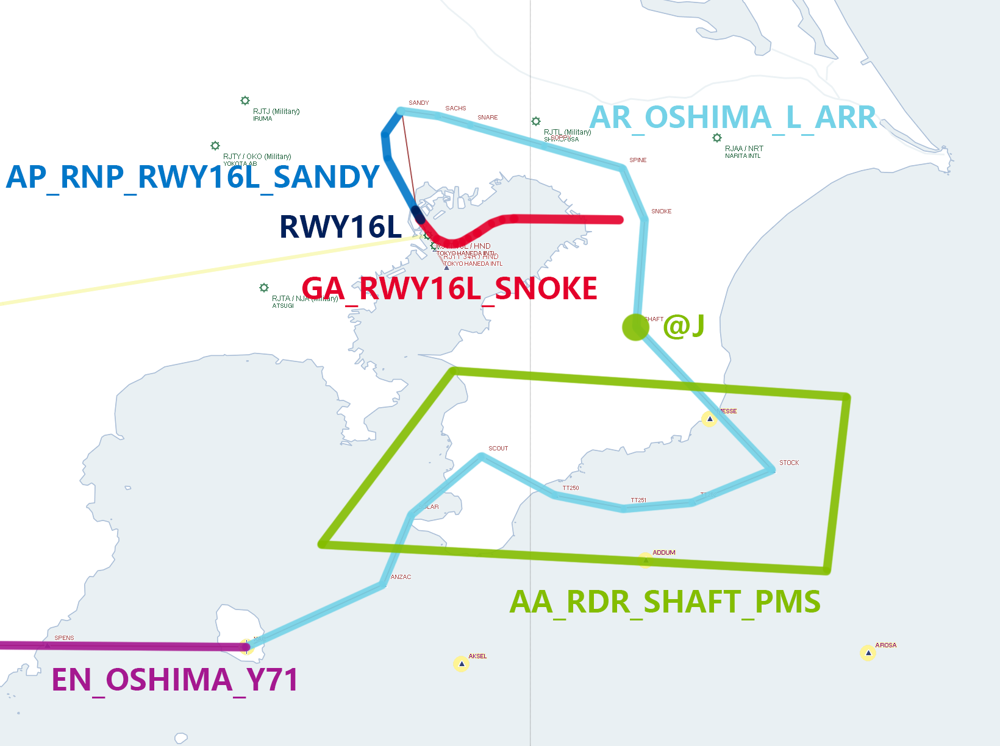
Example of arrival chart
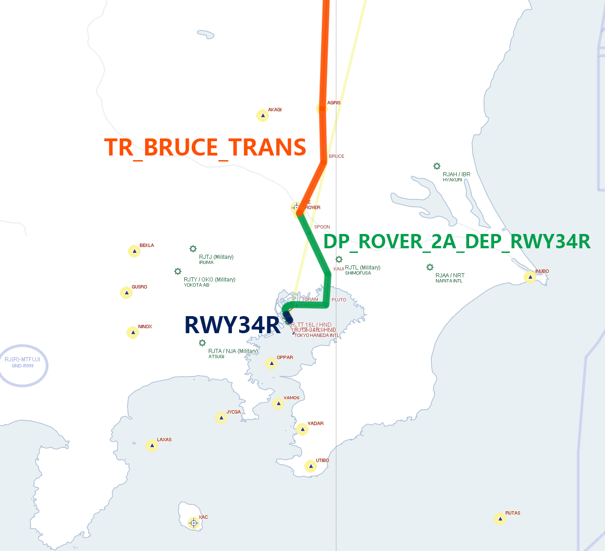
Example of departure chart
Routes can be merged as needed.
```ini
[HEADER]
name=EN_SOUTH_BLITZ
x=139:46:52
z=35:33:12
staff=
comment=
count=3
[RADAR]
direction=30,50,90,150,360
area=AA_S-RTE_D_22-23APP
areadistance=3000
areaaltft=8000
[RUNWAYCHANGE]
area=AA_S-RTE_D_ALLRWYCHG
areadistance=0
[DIRECT]
area=AA_S-RTE_D_22-23DIRECT
areadistance=0
exit=disable
[POINT]
-3273.89,4572.00,-118367.69,0,
41477.02,3048.00,-73609.32,0,ADDUM
51029.29,2482.24,-47582.67,0,BLITZ
```
Method to call AA_DIR_xxx.aad
### arg
GP_xxx.arg
```
[HEADER]
name=GP_AP22_NORTH_DATUM
comment=
count=4
[ROUTE]
1,DM_DATUM_OUTSIDE
1,AR_DATUM_ARR
1,AP_LDA_X_RWY22
1,RWY22
```
Haven't used it, not sure what it does. Suspected to be a combined route.
## Required Software
> Aerosoft Professional Flight Planner X (PFPX)

> ESRI ArcGIS

> Microsoft Excel (WPS is a substitute)

> Notepad (VS Code is a substitute, Notepad also works)

### Navigation Data
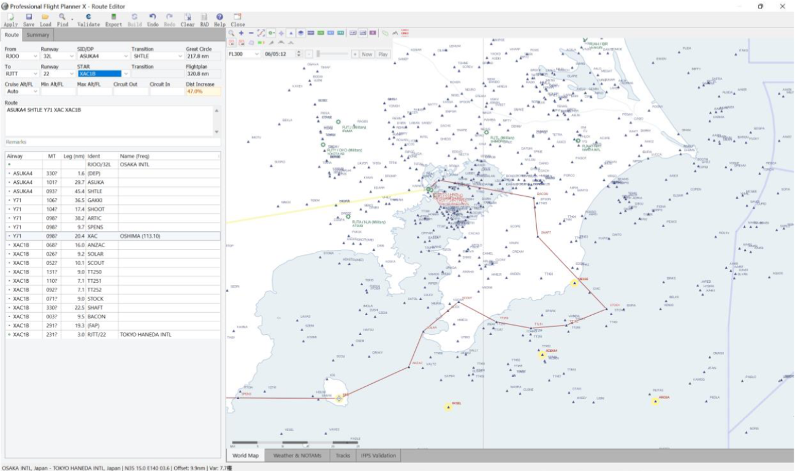
Import route data from flight simulation into PFPX for intuitive procedure viewing and as a base map for route drawing.
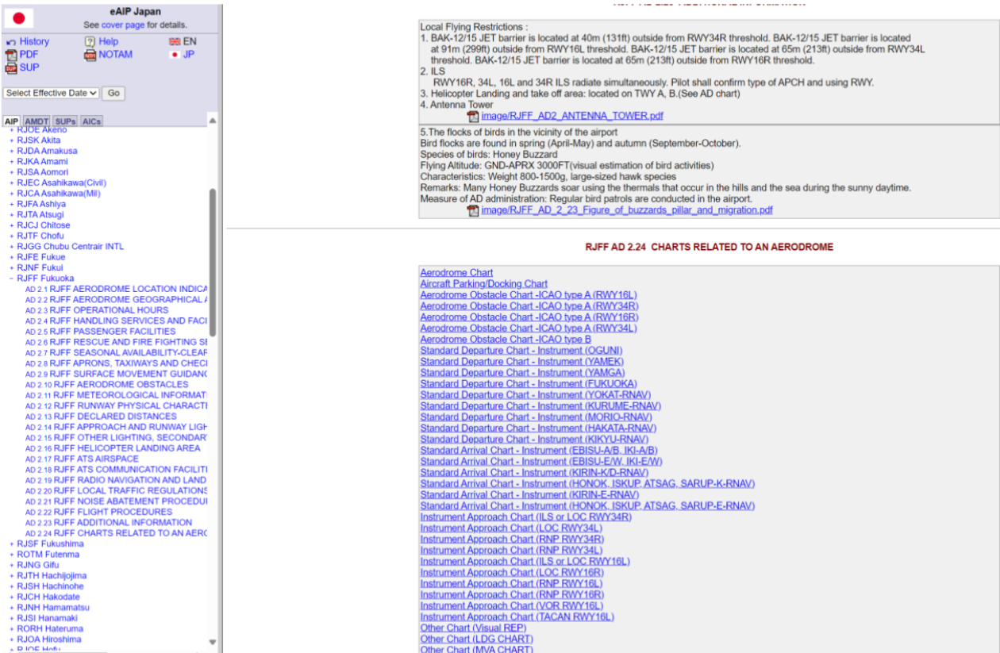
Download charts from AIS JAPAN (registration required, free).
## Making
### For the airport to be documented, take a screenshot in PFPX as the base map.
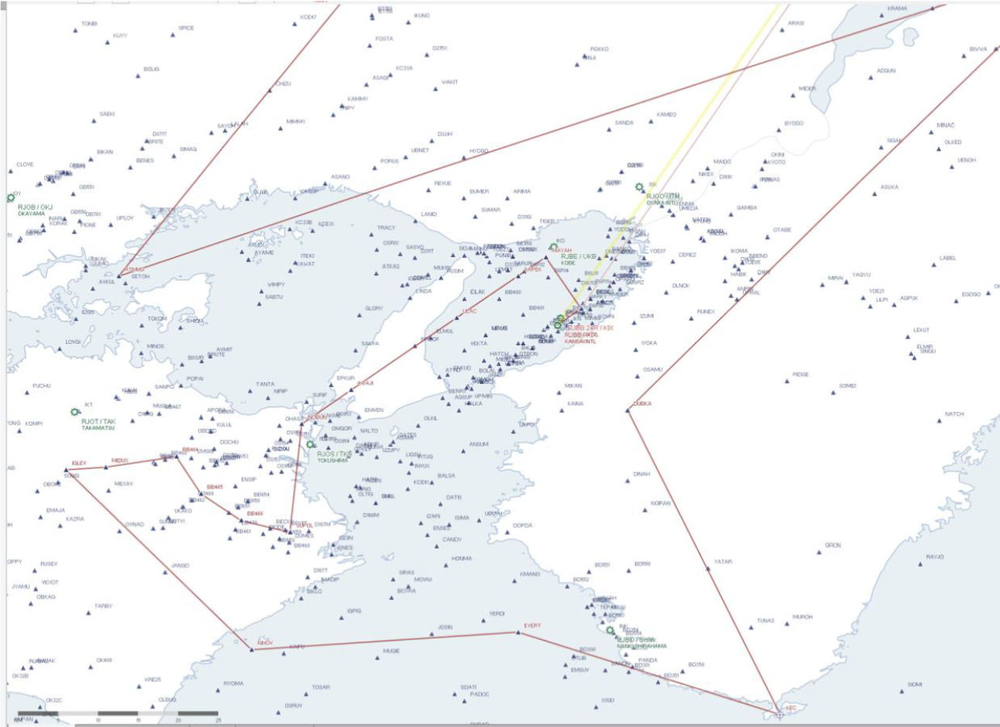
### Find known points in ROUTE as control points.
Open any .ard route file with VS Code.
```ini
[HEADER]
name=DM_EVERT
x=135:13:58
z=34:26:03
staff=
comment=
count=4
[POINT]
130473.67,3048.00,-117655.26,0,
51568.67,3048.00,-109711.10,0,KUSHIMOTO
8828.39,3048.00,-107481.66,0,KISEI
-9153.91,3048.00,-86444.36,0,EVERT@D@R2@X1
```
```ini
[HEADER]
name=AP_ILS_RWY09
display=ILS_RWY09_APP
x=135:13:58
z=34:26:03
staff=
comment=
count=3
[POINT]
-24208.68,914.40,19842.76,0,SIOJI
-18537.57,914.40,20390.94,0,MARIN
-3849.15,102.23,21664.30,0,
```
```ini
[HEADER]
name=DM_SINGU
x=135:13:58
z=34:26:03
staff=
comment=
count=3
[POINT]
158394.11,6096.00,30082.96,0,KOHWA
82548.89,6096.00,-9240.94,0,SINGU
999.08,2609.47,-51715.26,0,Z_SINGU@X1@R2
```
In this example, points like EVERT, SIOJI, SINGU can be found in the ```[POINT]``` section. Use these three points as control points (at least 3 points are needed).
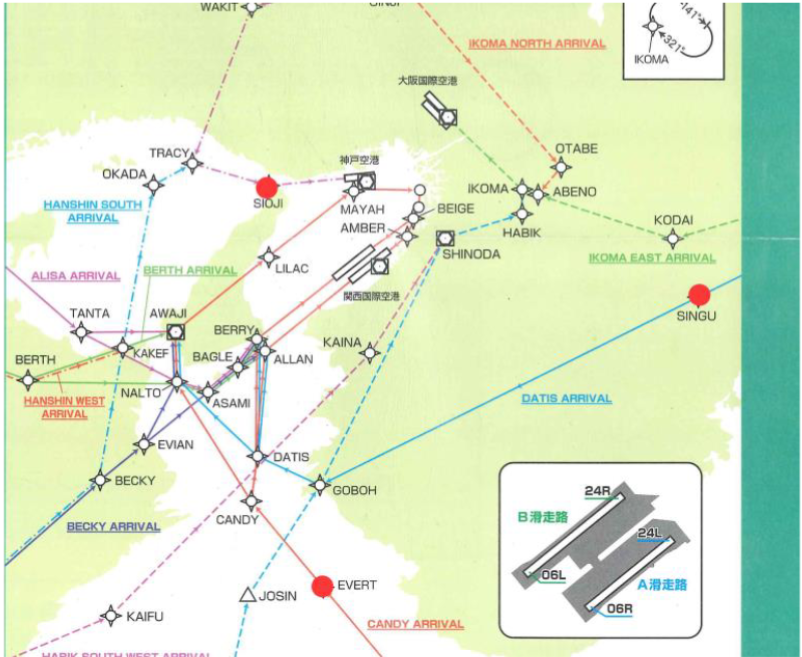
Control points should be as far apart as possible and not collinear.
```ini
x,y,z,speed,name
82548.89,6096,-9240.94,0,SINGU
-24208.68,914.40,19842.76,0,SIOJI
-9153.91,3048.00,-86444.36,0,EVERT
```
Put these 3 points into a CSV file.
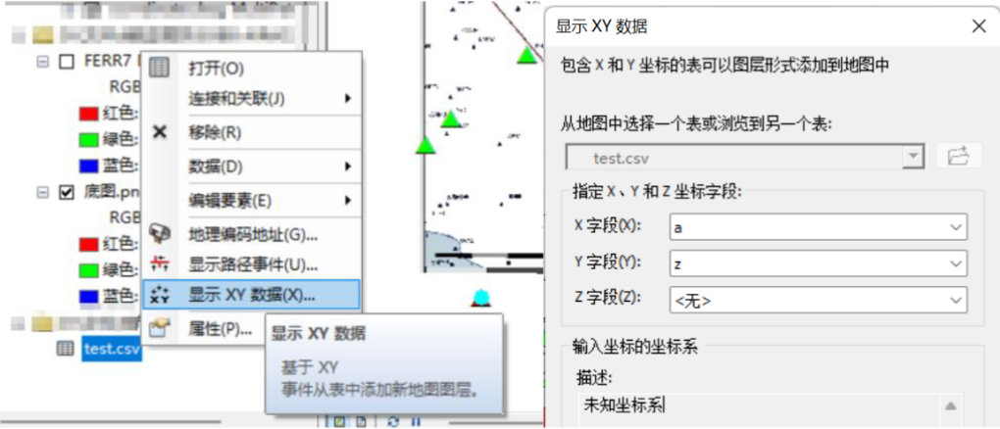
Then import into ArcMap, display x,y data. Select x for the X field and z for the Y field.
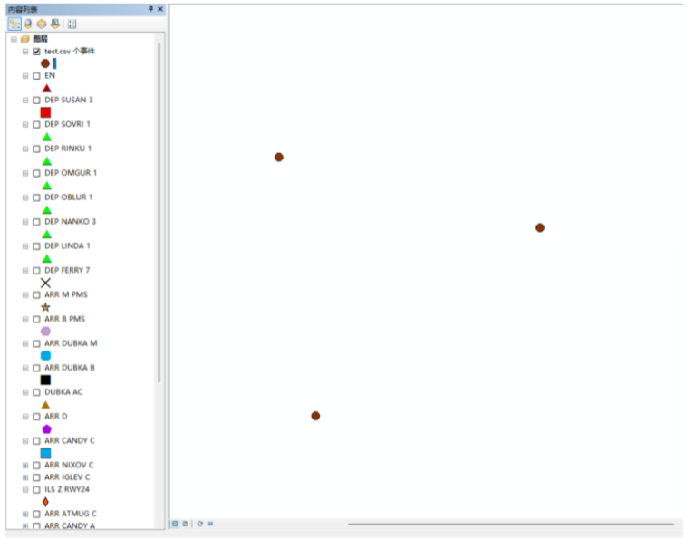
After import, points will be generated on the map.
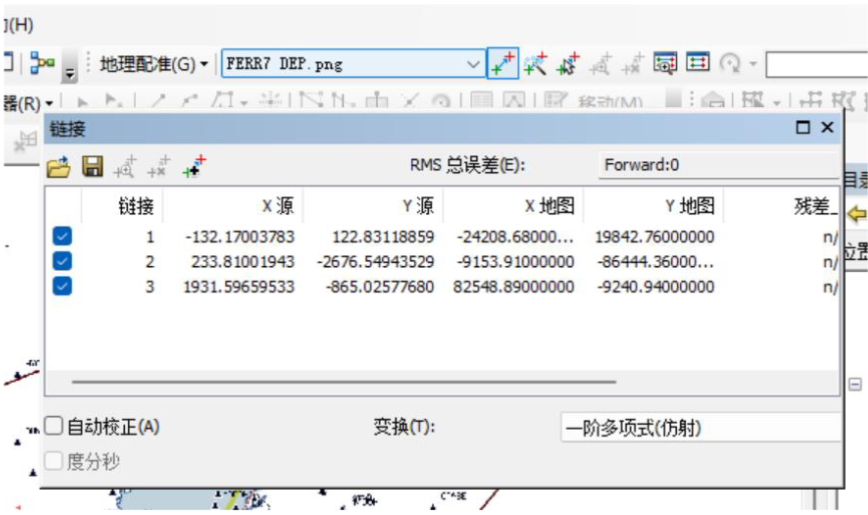
### Georeferencing
Use the Georeferencing tool to rectify the image. Choose First Order Polynomial for transformation.
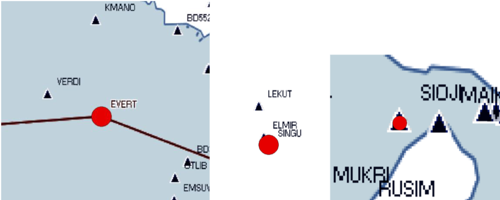
After rectification, the base map's position will correspond to the position in ATC4.
### Getting Waypoint Coordinates
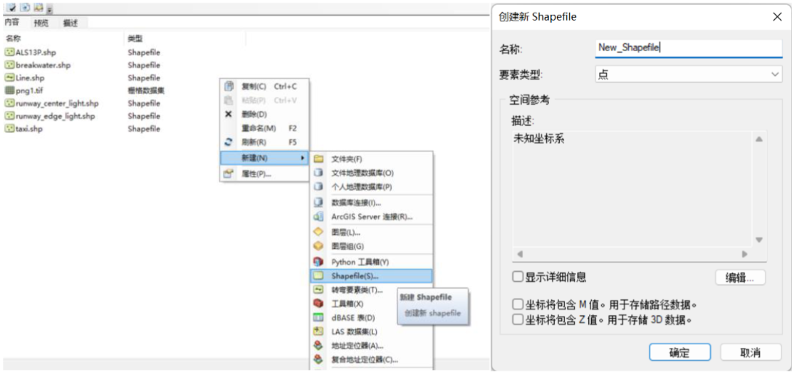
Create a shapefile (point feature) in ArcCatalog.
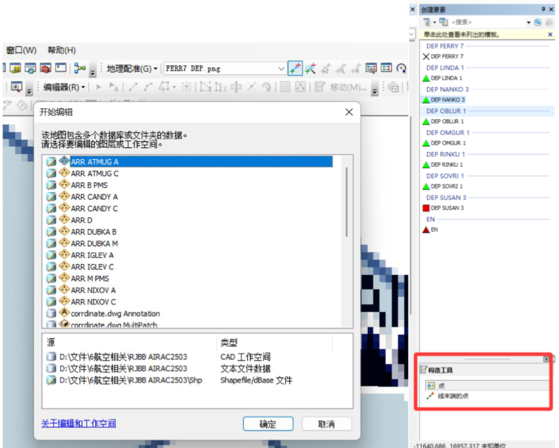
In the Editor, use the construction tool to place waypoints for the route one by one (this saves time but still takes considerable effort).
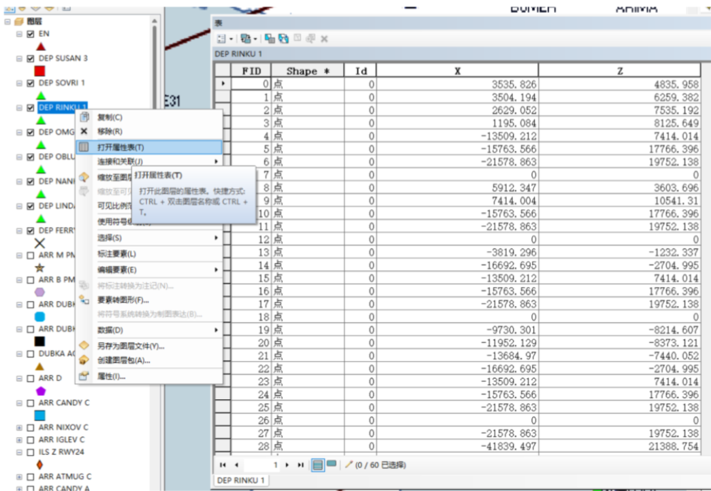
Open the attribute table to see the coordinates, copy them, and paste into a CSV file for editing with Excel.
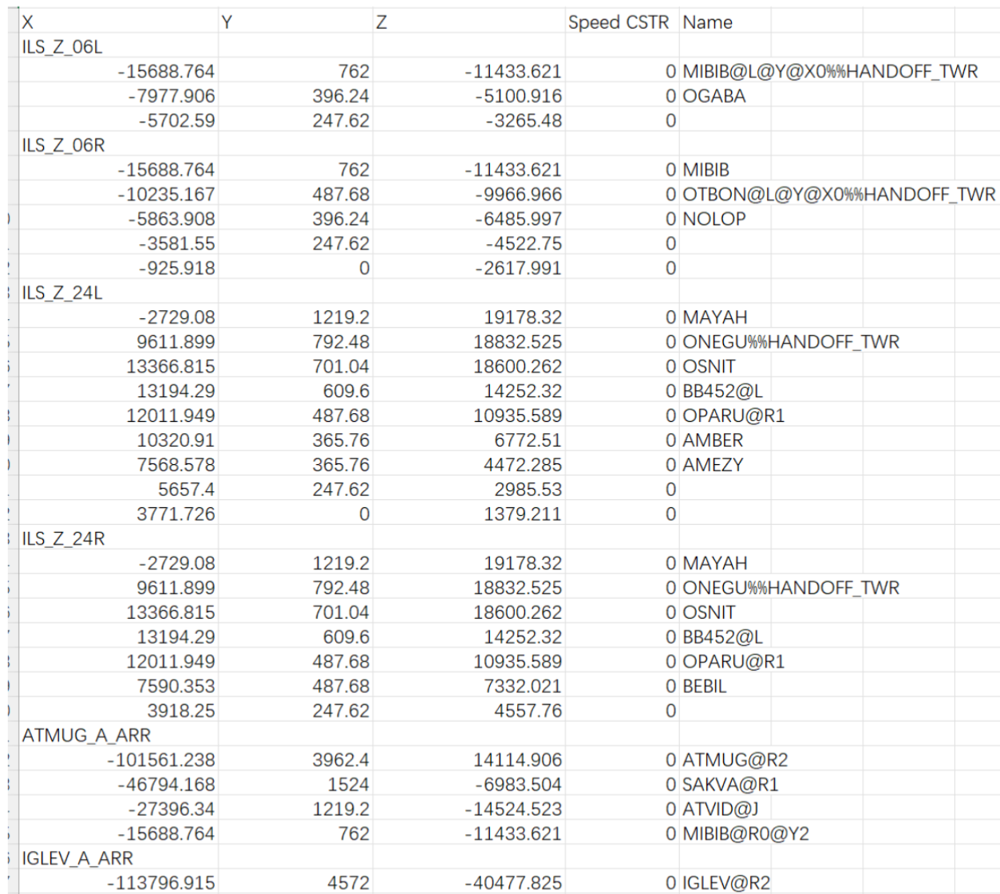
This gives you the content for the [POINT] section.
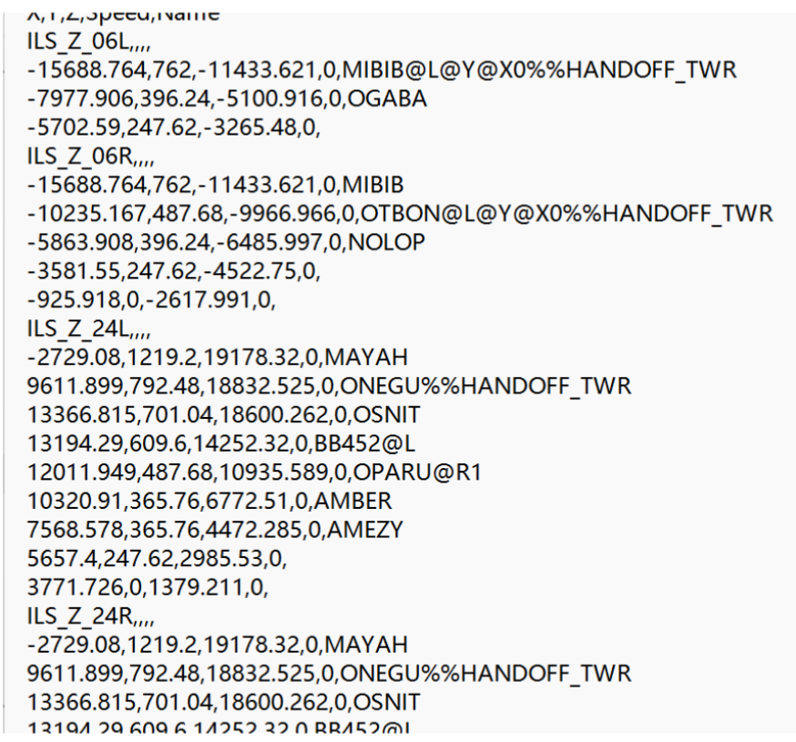
Finally, complete the information in [HEADER] to successfully create the route.
## routetable.ini
By default, it's placed in ```ATC4\PORT\RXXX\SCENARIO```. If modifications are made, place it in ```SCENARIO\0015_xxxx_ Stage``` like command and state files to avoid affecting all scenarios.
```ini
[AREA_A]
;DEP SOUJA ARR ATMUG
LTFM=Istanbul
LIMC=Milan
EGLL=London
[AREA_B]
;DEP OLIVE ARR ATMUG
ZYHB=Harbin
UUEE=Moscow

[AREA_C]
;DEP GUJYO ARR ATMUG
RJCC=Sapporo
RJCH=Hakodate

20


[AREA_D]
;DEP NANKO_KCC ARR ATMUG
LFPG=Paris
EHAM=Amsterdam
EFHK=Helsinki

[AREA_E]
;DEP SOVRI_KCC ARR DUBKA
RJSS=Sendai
```
> If you know the standard for ini format, you might not need to read the rest.
/[AREA_?]
Area number, for zoning airports.
```ini
;Comment
```
Airport ICAO=Airport name```ICAO=name```
```ini
[DEP_ROUTE]
GP_DP06L_SOUJA=RWY06L,DP_RINKU_1_DEP_RWY06L,TR_MAIKO_SOUJA_TRANS
GP_DP06L_OLIVE=RWY06L,DP_IWAYA_3_DEP_RWY06L,TR_MAIKO_OLIVE_TRANS,DM_OLIVE_V38
GP_DP06L_GUJYO=RWY06L,DP_NANKO_3_DEP_RWY06L,TR_NANKO_GUJYO_TRANS
GP_DP06R_WASYU=RWY06R,DP_LINDA_1_DEP_RWY06R,TR_LINDA_WASYU_D_TRANS
GP_DP24L_SOUJA=RWY24L,DP_RINKU_1_DEP_RWY24L,TR_MAIKO_SOUJA_TRANS
```
[DEP_ROUTE]
Departure routes.
Combination name=route1,route2,... (name of .ard files in ROUTE). CombinationName=route1,route2
```ini
[DEP_TABLE_A]
comment=Day
time=0000-2359
wind=282-178
visibility=00000-99999
runway=RWY06L,RWY06R,RWY24L,RWY24R
active=RWY06L,RWY06R

21

AREA_A=GP_DP06L_SOUJA/GP_DP06R_SOUJA/GP_DP24L_SOUJA/GP_DP24R_SOUJA
AREA_B=GP_DP06L_OLIVE/GP_DP06R_OLIVE/GP_DP24L_OLIVE/GP_DP24R_OLIVE
AREA_C=GP_DP06L_GUJYO/GP_DP06R_GUJYO/GP_DP24L_GUJYO/GP_DP24R_GUJYO
...

[DEP_TABLE_B]
comment=Day
time=0000-2359
wind=102-358
visibility=00000-99999
runway=RWY06L,RWY06R,RWY24L,RWY24R
active=RWY24L,RWY24R
AREA_A=GP_DP06L_SOUJA/GP_DP06R_SOUJA/GP_DP24L_SOUJA/GP_DP24R_SOUJA
AREA_B=GP_DP06L_OLIVE/GP_DP06R_OLIVE/GP_DP24L_OLIVE/GP_DP24R_OLIVE
AREA_C=GP_DP06L_GUJYO/GP_DP06R_GUJYO/GP_DP24L_GUJYO/GP_DP24R_GUJYO
```
[DEP_TABLE_?]
Departure table, ? part is filled sequentially from A, depending on the number of operational scenarios.
```ini
comment=Comment
time=Time (hhmm-hhmm)
wind=Wind direction
visibility=Visibility
runway=All runways
active=Active runways
AREA_?=Takeoff combination name from runway1/Takeoff combination name from runway2/...
```
```ini
[APP_ROUTE]
GP_AP06L_ATMUG_B=RWY06L,AP_ILS_Z_RWY06L,AR_ATMUG_B_ARR
GP_AP06L_DUBKA_B=RWY06L,AP_ILS_Z_RWY06L,AR_DUBKA_B_ARR
GP_AP06L_EVERT_B=RWY06L,AP_ILS_Z_RWY06L,AR_EVERT_B_ARR,EN_Y46_EVERT
```
[APP_ROUTE]
Arrival routes.
Combination name=route1,route2,... (name of .ard files in ROUTE). CombinationName=route1,route2
```ini
[APP_TIME]
Not sure what is the use of it, it can be blank. Not sure what it's for, might affect aircraft spawn time in scenario-based levels, can be left blank.

[APP_TABLE_A]
comment=Day Clear
time=0540-2240
wind=000-359
visibility=09001-99999
runway=RWY34L,RWY34R,RWY22,RWY23,RWY16L,RWY16R
active=RWY34L,RWY34R,RWY22,RWY23,RWY16L,RWY16R
AREA_A=GP_AP34L_GODIN2K/GP_AP34R_GODIN1H/GP_AP22_GODIN1D/GP_AP23_GODIN1D/GP_AP16L_GODIN_L_HIGH/GP_AP16R_GODIN_R_HIGH
AREA_B=GP_AP34L_AROSA1K_SOUTH/GP_AP34R_AROSA1A_SOUTH/GP_AP22_AROSA1B_SOUTH/GP_AP23_AROSA1B_SOUTH/GP_AP16L_AROSA_L_SOUTH_HIGH/GP_AP16R_AROSA_R_SOUTH_HIGH
AREA_C=GP_AP34L_GODIN2K/GP_AP34R_GODIN1H/GP_AP22_GODIN1D/GP_AP23_GODIN1D/GP_AP16L_GODIN_L_HIGH/GP_AP16R_GODIN_R_HIGH

[APP_TABLE_B]
comment=Day Fog
time=0540-2240
wind=000-359
visibility=00000-09000
runway=RWY34L,RWY34R,RWY22,RWY23,RWY16L,RWY16R
active=RWY34L,RWY34R,RWY22,RWY23,RWY16L,RWY16R
AREA_A=GP_AP34L_GODIN1C/GP_AP34R_GODIN1C/GP_AP22_GODIN1S/GP_AP23_GODIN1S/GP_AP16L_GODIN_L_LOW/GP_AP16R_GODIN_R_LOW
AREA_B=GP_AP34L_AROSA1A_SOUTH/GP_AP34R_AROSA1A_SOUTH/GP_AP22_AROSA1N_SOUTH/GP_AP23_AROSA1N_SOUTH/GP_AP16L_AROSA_L_SOUTH_LOW/GP_AP16R_AROSA_R_SOUTH_LOW
AREA_C=GP_AP34L_GODIN1C/GP_AP34R_GODIN1C/GP_AP22_GODIN1S/GP_AP23_GODIN1S/GP_AP16L_GODIN_L_LOW/GP_AP16R_GODIN_R_LOW
```
[APP_TABLE_?]
Arrival table.
comment=Comment
time=Time (hhmm-hhmm)
wind=Wind direction
visibility=Visibility
runway=All runways
active=Active runways
AREA_?=Landing combination name for runway1/Landing combination name for runway2/...
## fix.ini
File location: ```ATC4\PORT\RXXX\RADAR```
```ini
[FIX]
KANSAI,135:15:06.00,34:25:48.00,VORDME
SHINODA,135:26:53.00,34:29:31.00,VORDME
TOMO,135:00:20.00,34:16:49.00,VORDME
MAIKO,134:59:49.06,34:36:39.73,WAYPOINT
KOBE,135:13:42.00,34:37:51.00,VORDME
ASUKA,136:01:54.73,34:46:02.72,FIX
LINDA,134:51:40.12,34:30:15.76,WAYPOINT
```
Waypoint name, Longitude (degrees:minutes:seconds), Latitude (degrees:minutes:seconds), Waypoint type. **There is an upper limit on the number of waypoints (not sure exactly, Kansai has around 190).** This file is used to set aircraft spawn points. When using the scenario editor, enter the waypoint name in the "Air Spawn Position" (if a waypoint not in fix.ini is entered, the aircraft will spawn directly at 0,0).
