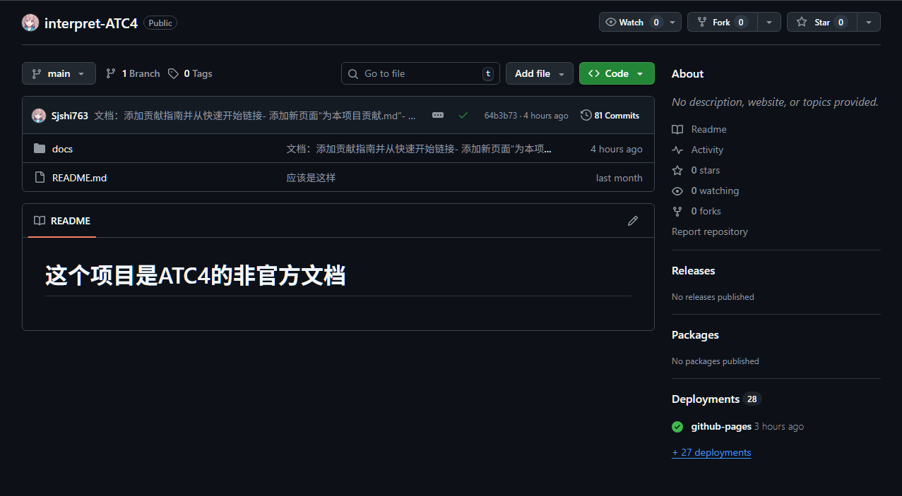
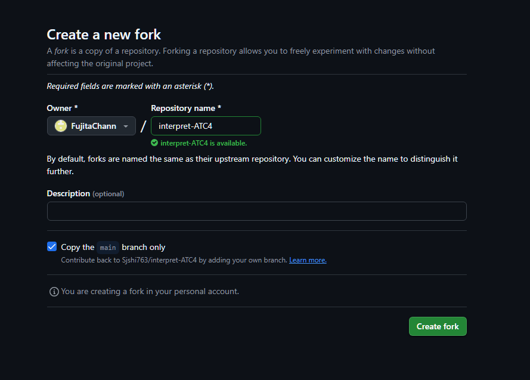
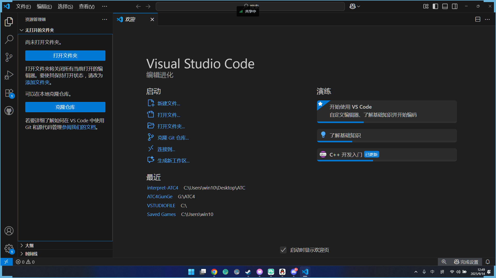
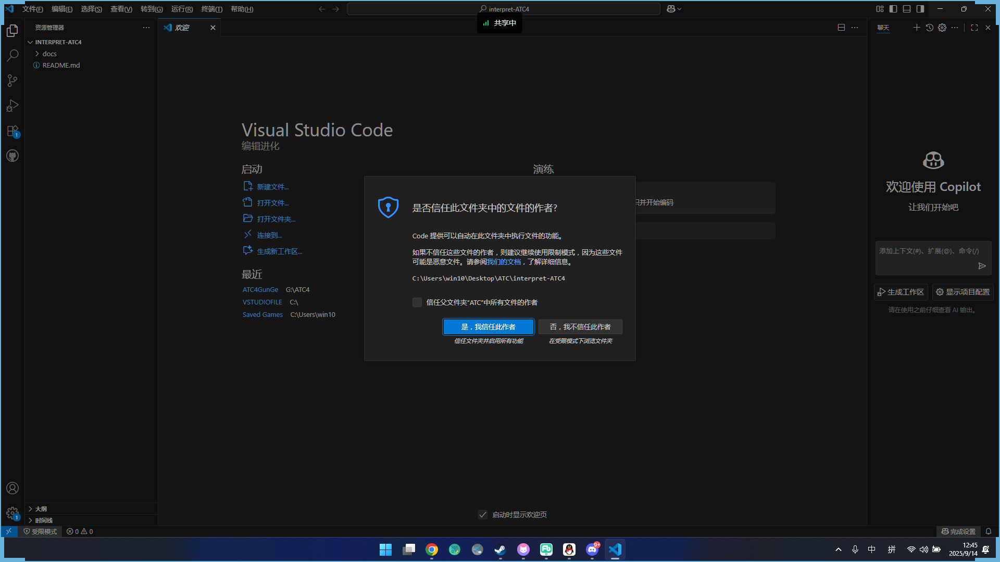
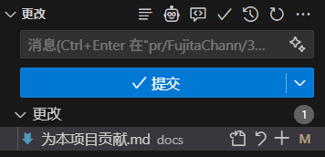

# 为本项目贡献
如果你想要为本项目贡献一些解决方案请提交pr，本文会详细说明如何提交pr
但是为了避免别人有类似的问题，或者有人在关注或者修改相同的问题，所以任何修改需要在开始前在issue中进行讨论
- 准备的环境
    1. 确保你已经安装和配置了git
    2. 拥有一个有效的GitHub账号
    3. 安装任何IDE（推荐使用VSCode）
- 如果可以以下是加分项
    1. 安装npm
    2. 会用终端
1. 首先，Fork这个项目

点击`fork`按钮
2. 编辑详细信息

3. 然后，克隆你Fork的项目到本地
    1. 打开你的vscode
    2. 点击克隆仓库
    
    3. 信任或者不信任这个仓库
    
4. 开始修改，并且保存你的修改

5. 提交一个commit

在本地推送你的修改

开始提交PR

等待审核，如果有修改请求，及时进行修改

大功告成！ 你的贡献已经被合并到主项目中（在 #29就是为本项目贡献的示范之一，非常感谢您的贡献！）