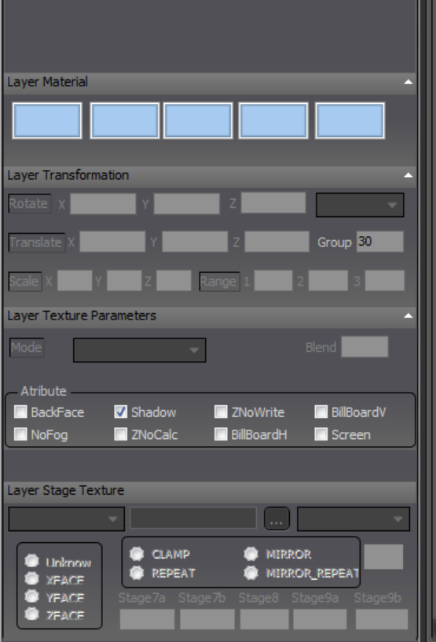

# 模型
## PVM格式
`.pvm` 格式是ATC4 唯一可读模型文件，可用`PVM Editor`编辑
文件内容实例（用vsc打开）：
```
Layer("jacket_leg2_h"){ 
Material(#00E8E8E8,#00000000,0,#00A0A0A0,#00000000) 
Mode("TEXTURE1") 
Group(2) 
Stage("NORMAL_SHADE","@d_rwy_jacket_01.dds",0,"REPEAT","MIPMAPANISOTROPIC","U
nkown") 
Face(2,1,0) 
Face(0,1,3) 
...
Vertex([0.70009,-16.4,0.70004],[0.69636,0.17365,0.69636],[0.21093,0.71094]) 
Vertex([0.70009,-6.4,-0.69997],[0.69636,0.17365,-0.69636],[0.11718,0.39844]) 
...
}
```
"jacket_leg2_h"：组件名称 
Mode("TEXTURE1")：单张贴图 
Mode("TEXTURE2")：两张贴图 
Group(2)：渲染层级 
Stage("NORMAL_SHADE","oasis_02.bmp",0,"REPEAT","LINEAR","Unkown") 
NORMAL_SHADE 贴图模式 
oasis_02.bmp 贴图（仅支持24 位.bmp 或DXT3 的.dds） 
REPEAT：重复 
Face：面 
Vertex：点
```

> 具体内容见PVM Editor