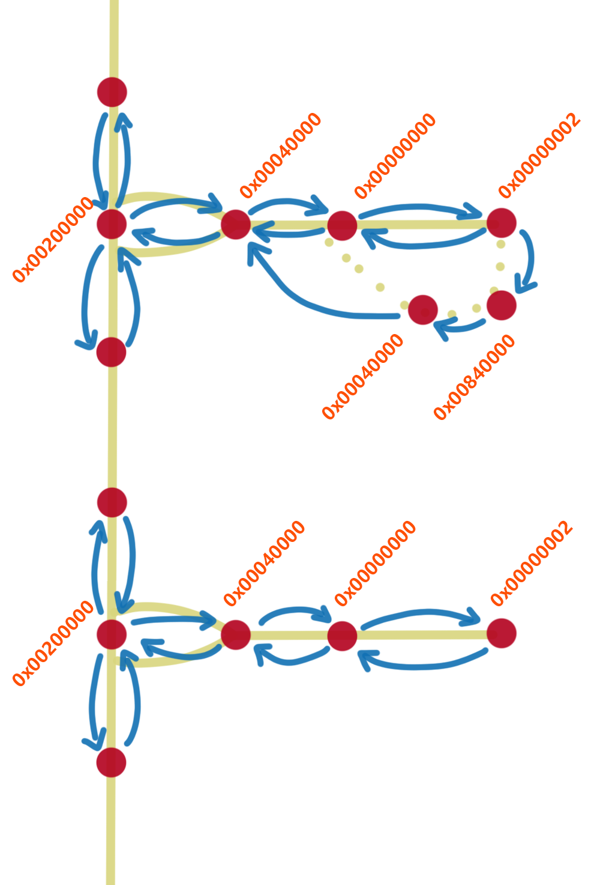

# 滑行和推出路线
## taxi.csv
文件位于```ATC4\PORT\Rxxx\GROUND```，一旦更改将作用于所有关卡
|点编号|名字|不清楚|是否为路线选择点|x坐标|z坐标|点属性|相邻点|相邻点|相邻点|相邻点|
|---|---|---|---|---|---|---|---|---|---|---|
|2502|_NoName|1|0|369.683|1305.92|0x00080000|93|92|||
|2503|_NoName|1|0|1929.88|-3154.16|0x00080000|174|175|||
|2505|_NoName|1|0|2310.85|-2755.72|0x00000000|2483|179|||
|2506|_NoName|1|0|3261.93|-1684|0x00080000|1178|1177|||
|2509|_NoName|1|0|284.286|-1339.88|0x00080000|336|27|2510||
|388|D3|1|1|2165.99|-2934.08|0x80020001|389|387||||
|389||1|0|2214.19|-2913.83|0x80000000|388|391||||
|2482|D4|1|1|2214.19|-2792.81|0x80020001|2485|||||
|1170|D5|1|1|2315.49|-2720.05|0x80020001|1172|1169||||
|1179|D6|1|1|3313.63|-1730.98|0x80020001|1180|1178||||
|325|D7|1|1|1341.69|-1372.36|0x80020001|328|324||||
点属性中
```ini
0x00000000 = 普通的点 
0x00000002 = 停机坪 
0x00840000 = 自滑点 
0x00040000 = 出现在机坪中间的点（不清楚干啥的） 
0x00200000 = 滑行道与机坪的连接点
```

机位的点的属性和连接关系（上：自滑位，下：普通机位）
|点属性|说明|
|--|--|
|0x00008000	|高速滑行道(滑行速度可达28kt)|
|0x00200000	|停机坪入口(停机坪与滑行道相连点)|
|0x00040000	|意义不明,出现于停机坪入口附近|
|0x00000000	|常规滑行道(滑行速度20kt)|
|0x00010004	|跑道上滑行道起始点(快速脱离道)|
|0x00000004	|跑道上滑行道起始点/终点(垂直脱离)|
|0x80000011	|意义不明|
|0x80020001	|跑道入口/出口停止点|
|0x00020000	|意义不明,出现于停止点附近(疑似用于播报停止点名称?)|
|0x80008011	|意义不明|
|0x80000000	|意义不明,出现于成田GWY附近|
|0x00028000	|意义不明,出现于GPHOLD前|
|0x00088000	|GPHOLD停止点|
|0x80020211	|GWY停止点|
|0x00000002	|停机坪|
RZD 整理的表格↑