# 航路制作
## 航路文件相关
所有航路文件被放在```ATC4\PORT\ICAO\ROUTE```文件夹内
### aad
AA_RDR_xxx.aad 
雷达引导区 
AA_DIR_xxx.aad 
飞机飞进此区域后允许直飞某个点 
```ini
[HEADER]
name=AA_RDR_CREAM_PMS
x=139:46:52
z=35:33:12
staff=
comment=
count=5
[POINT]
30042.04,914.40,-7544.51,0,
50771.75,914.40,-50390.96,0,
69267.18,914.40,-41323.79,0,
44021.00,914.40,10245.25,0,
34406.99,914.40,5509.01,0,
```
```ini
[HEADER] 
Name：名字 
x,z：机场基准点ARP 经纬度坐标（度分秒） 
count：POINT 内坐标点的数量 
[POINT] 
X 坐标,箭头指向高度,Z 坐标,速度, 
X,Y,Z,Speed, 
...... 
按点的顺序围成一个多边形的雷达引导区 
坐标为相对ARP 的位置 
其中所有坐标和高度单位为m 
速度单位为kt
```

> 箭头指向高度和飞行无关，仅影响绿色箭头的指向

> FINAL

若雷达引导区直接引导至五边，则加上
这一条参数 
```
x,y,z,spd,   (相对远离跑道的点1) 
x,y,z,spd,    (相对靠近跑道的点2) 
```
就像这样(只负责演示，别直接复制粘贴)
```ini
[HEADER]
name=AA_RDR_SHINO
x=136:48:19
z=34:51:30
staff=
comment=
count=5
[FINAL]
-11096.00,1500.00,85778.00,0,
-27736,883.92,69877,0
[POINT]
-13104,914.4,84725,0,
-3643,914.4,65988,0,
-35251,914.4,45614,0,
-40088,914.4,52006,0,
-30641,914.4,772560,0,
```
### ard
```ini
[HEADER]
name=AR_OSHIMA1A_ARR
display=OSHIMA_1A_arrival
x=139:46:52
z=35:33:12
staff=
comment=
count=11
[RADAR]
direction=40,80,120,160,200,280,320,360
area=AA_RDR_WEDGE_PMS
areadistance=3000
areaaltft=10000
[POINT]
-33246.47,4572.00,-93547.95,0,OSHIMA@R2@Y3
-20463.39,4267.20,-86369.24,0,
-7680.32,3962.40,-79190.54,0,ANZAC
352.21,3962.40,-74705.11,0,TT450@Y2
16158.63,3962.40,-79561.91,0,TT451
28883.24,3962.40,-77819.37,0,TT452
40098.38,3962.40,-71476.62,0,TT453
49864.73,3962.40,-57980.20,0,WANDA@R0@Y0
33920.11,3200.40,-51413.39,0,
17975.49,2438.40,-44846.58,0,WEDGE@J@X1
18309.56,1828.80,-32956.59,0,ARLON@D
```
```ini
[HEADER] 
Name：名字 
Display：显示在游戏中的内容（使用ルート）
```
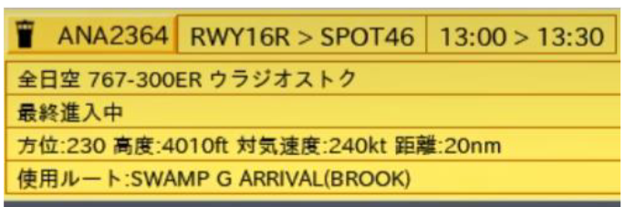
```ini
x,z：机场基准点ARP 经纬度坐标（度分秒） 
count：POINT 内坐标点的数量 
[RADAR] 
雷达引导，非必要内容 
Direction：引导可选航线（磁航向） 
Area：填入需要调用的雷达引导区（aad 文件） 
Areadistance:？ 
Arealift：被雷达引导之后的飞行高度
```
[POINT] 
X 坐标,  高度, Z 坐标,  速度（0 为不进行限速）,  航点名称```@ROUTE_MARKER``` ```ROUTE_MARKER```的作用每个机场都可能不一样，具体作用写在state 文件里 一般@D 是创建直飞点，@L 为放下起落架的位置，@J 是雷达引导最终的直飞点
```Ini
;------------------------------------------------------------------------------------------------------------------------------------------------------
; 到着機が飛行中（アプローチセクション）
[APPROACH_APP:Approaching:飛行中]
  {($SHIP_FLAG_RADARVECTOR == 1) && ($SHIP_GOAROUNDED == 0)} <RADARVECTOR_SELECT>
  {($SHIP_FLAG_RADARVECTOR == 1) && ($SHIP_GOAROUNDED == 0) && ($USERFLAG01 == 1)} <FINALAPPROACH>
  {($SHIP_FLAG_RWYCHANGE == 1) && ($USERFLAG04 == 0)} <RUNWAY_SELECT_ALL>
  {($ROUTE_MARKER_R == 1) && ($USERFLAG04 == 0) && ($SHIP_GOAROUNDED == 1)} <RUNWAY_SELECT_GA>
  {($SHIP_LOCKIAS == 0) && ($USERFLAG15 == 1) && ($SHIP_ALT > 3000) && ($SHIP_ALT < 10000)} <REDUCE_SPEED_180>
  {($SHIP_LOCKIAS == 180) && ($USERFLAG15 == 1)} <RESUME_NORMAL_SPEED>
  {($ROUTE_MARKER_X == 1) && ($USERFLAG01 != 1)} #STATE(APPROACH_APP_CLR)
  {$SHIP_ALT < 3000} #IAS(0)
  #WAITSTATE(APPROACH_APP,10)
```
也可以是： 
X 坐标,箭头指向高度,Z 坐标,速度,航点名称%%属性（例如```%%HANDOFF_TWR```）属性同样在state 文件中
```ini
;//////////////////////////////////////////////////////////////////////////////////////////////////////////////////////////////////////////////////////
; Route Entry State
;//////////////////////////////////////////////////////////////////////////////////////////////////////////////////////////////////////////////////////

;------------------------------------------------------------------------------------------------------------------------------------------------------
; APPからTWRハンドオフ
[%%HANDOFF_TWR]
  {($SHIP_UID == $VALUE07) && ($SHIP_SECTION == 12)} #STATE(APPROACH)
  {$SHIP_SECTION == 12} #STATE(SNA_FINAL)
  #MAINMENU()
  #FLAG(CONTACTTWR)
  #SETMARKER(Y,0)
  {$USERFLAG30 != 0} #STATE(APPROACH_APP_CLRREQ_LOOP)
  {$SHIP_UID == $VALUE06} #ROUTECHANGEPOINT(CACAO)
  #STATE(APPROACH_APP_HANDOFF)

[%%REPORT_HWYVIS]
  #SETMARKER(Y,0)
  {$SHIP_RWY_RWY34R == 1} #SETUSERFLAG(18,1)
  #STATE(VISUALAPP_REPINSIGHT)

[%%REPORT_CAPVIS]
  #SETMARKER(Y,0)
  {$SHIP_RWY_RWY34L == 1} #SETUSERFLAG(18,1)
  #STATE(VISUALAPP_REPINSIGHT)

[%%HANDOFF_HWYVIS]
  #SETMARKER(Y,0)
  #SETUSERFLAG(18,2)
  #STATE(VISUALAPP_HWAYINSIGHT)
  
```
AP_xxx.ard 
进场程序Approach 
AR_xxx.ard 
进近程序Arrival 
DM_xxx.ard 
外部接入航路，同DM 
EN_xxx.ard 
外部接入航路,同EN 
D1_xxx.ard 
离场程序（初始段，可以没有） 
DP_xxx.ard 
离场程序Departure 
TR_xxx.ard 
过度点Transition 
GA_xxx.ard 
复飞航路 
RWYxx.ard 
跑道位置 

到达图举例 
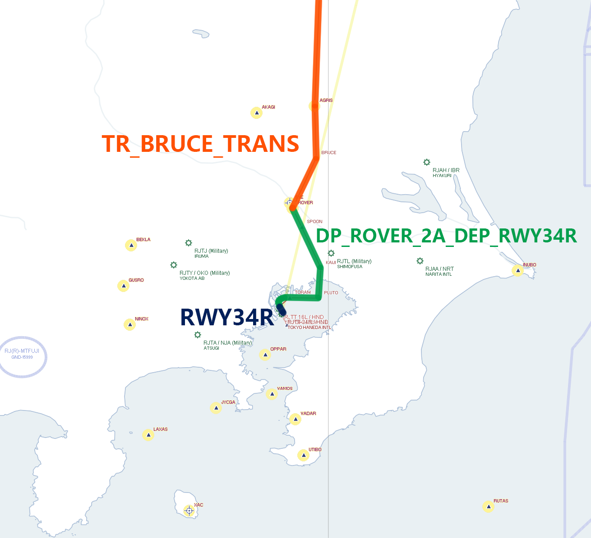
出发图举例 
可以视情况合并航线
```ini
[HEADER]
name=EN_SOUTH_BLITZ
x=139:46:52
z=35:33:12
staff=
comment=
count=3
[RADAR]
direction=30,50,90,150,360
area=AA_S-RTE_D_22-23APP
areadistance=3000
areaaltft=8000
[RUNWAYCHANGE]
area=AA_S-RTE_D_ALLRWYCHG
areadistance=0
[DIRECT]
area=AA_S-RTE_D_22-23DIRECT
areadistance=0
exit=disable
[POINT]
-3273.89,4572.00,-118367.69,0,
41477.02,3048.00,-73609.32,0,ADDUM
51029.29,2482.24,-47582.67,0,BLITZ
```
调用AA_DIR_xxx.aad 的方法
### arg
GP_xxx.arg
```
[HEADER]
name=GP_AP22_NORTH_DATUM
comment=
count=4
[ROUTE]
1,DM_DATUM_OUTSIDE
1,AR_DATUM_ARR
1,AP_LDA_X_RWY22
1,RWY22
```
没用过，不清楚是干什么的，疑似是组合航路
## 要求软件
> Aerosoft Professional Flight Planner X（PFPX）

> ESRI ArcGIS

> Microsoft Excel(平替就wps了)

> Notepad(平替就vscode了，不过记事本也可)

### 导航数据
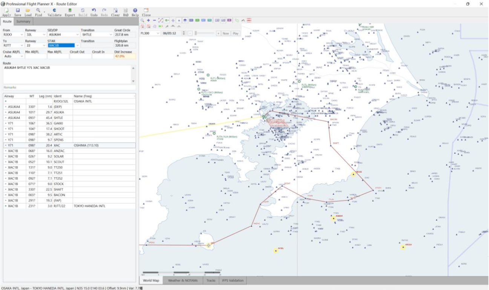
将模拟飞行用的航路数据导入 PFPX，方便直观地查看程序，并用作航路绘制的底图
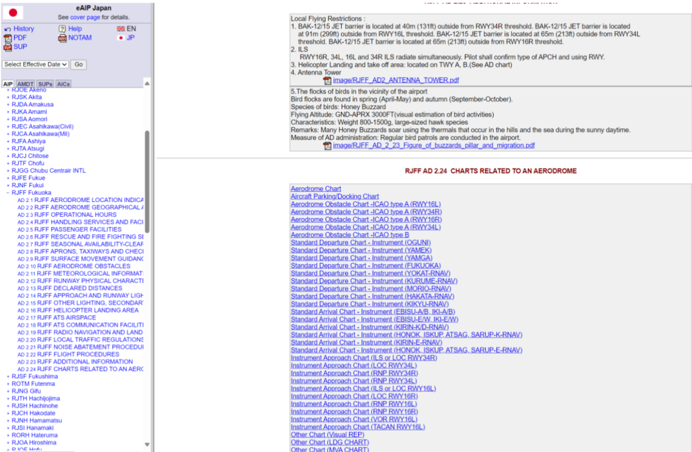
在AIS JAPAN 下载航图（需要注册，免费）
## 制作
### 对需要制作的机场，在 PFPX 内进行截图当作底图
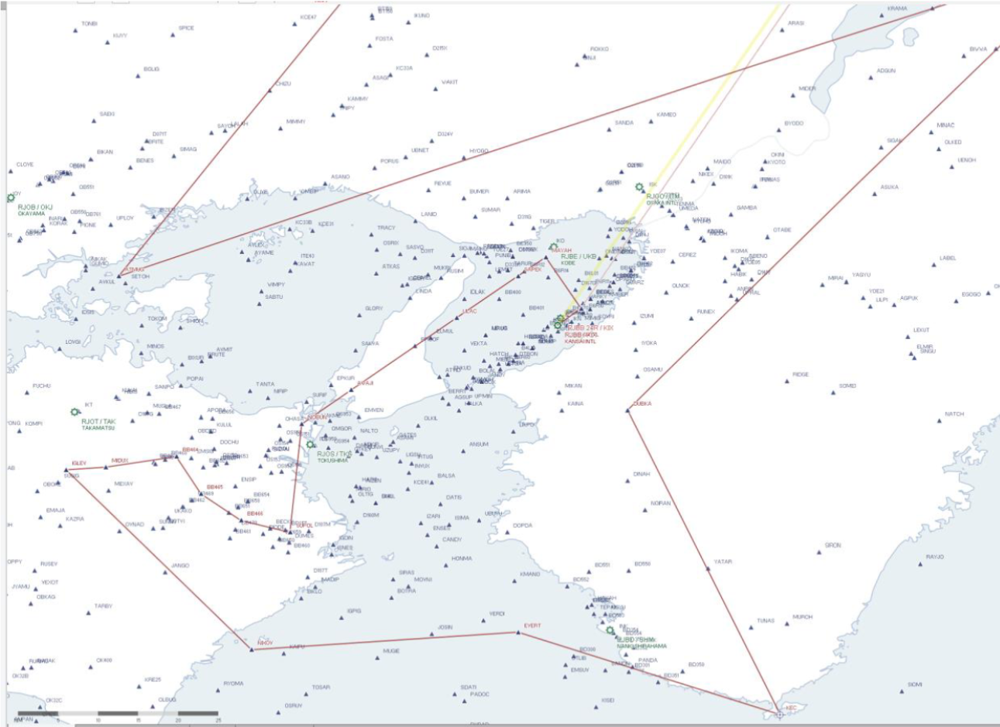
### 在 ROUTE 中寻找已知点作为控制点
随便用vscode打开一个.ard 结尾的航路文件
```ini
[HEADER]
name=DM_EVERT
x=135:13:58
z=34:26:03
staff=
comment=
count=4
[POINT]
130473.67,3048.00,-117655.26,0,
51568.67,3048.00,-109711.10,0,KUSHIMOTO
8828.39,3048.00,-107481.66,0,KISEI
-9153.91,3048.00,-86444.36,0,EVERT@D@R2@X1
```
```ini
[HEADER]
name=AP_ILS_RWY09
display=ILS_RWY09_APP
x=135:13:58
z=34:26:03
staff=
comment=
count=3
[POINT]
-24208.68,914.40,19842.76,0,SIOJI
-18537.57,914.40,20390.94,0,MARIN
-3849.15,102.23,21664.30,0,
```
```ini
[HEADER]
name=DM_SINGU
x=135:13:58
z=34:26:03
staff=
comment=
count=3
[POINT]
158394.11,6096.00,30082.96,0,KOHWA
82548.89,6096.00,-9240.94,0,SINGU
999.08,2609.47,-51715.26,0,Z_SINGU@X1@R2
```
本例子中，```[POINT]```内可以找到EVERT，SIOJI，SINGU 的坐标，将这三个点当作控制点（至少要有3 个点）
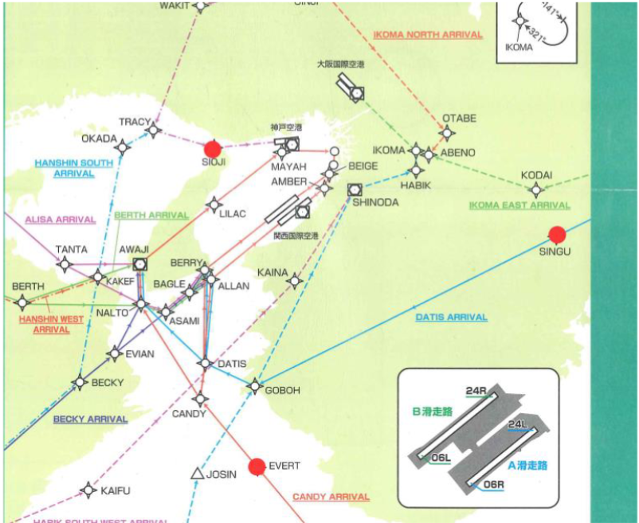
控制点尽量找离得远，不共线的点
```ini
x,y,z,speed,name
82548.89,6096,-9240.94,0,SINGU
-24208.68,914.40,19842.76,0,SIOJI
-9153.91,3048.00,-86444.36,0,EVERT
```
把这3 个点放入csv中
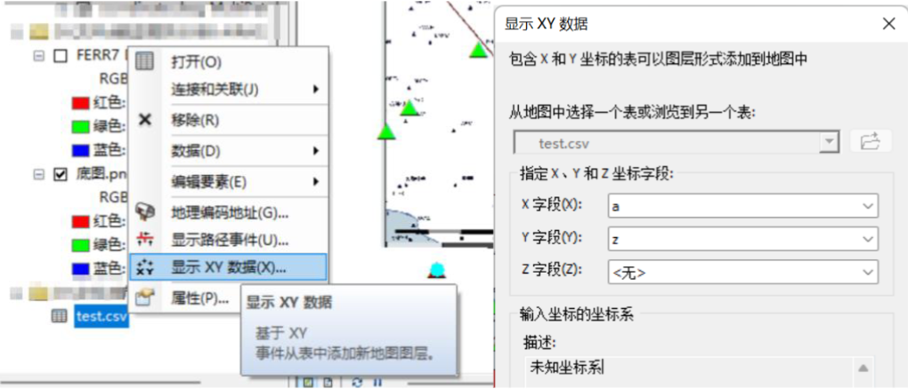
然后导入ArcMap，显示x,y 数据，X 字段选x，Y 字段选z
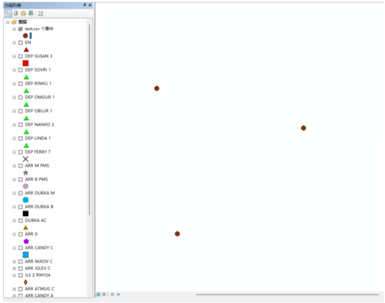
导入完后，点会生成在图上

### 地理配准
使用地理配准工具对图片进行配准，变换选择一阶多项式
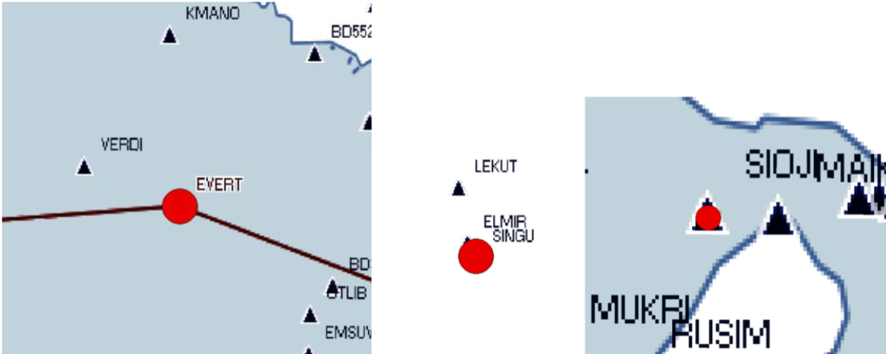
完成配准后，底图的位置就能和ATC4 里的位置对应上了
### 获取航点坐标
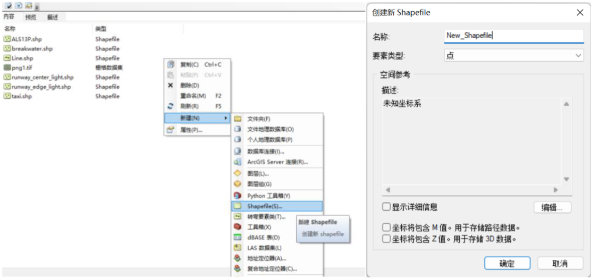
在ArcCatalog 中创建shapefile（点要素） 
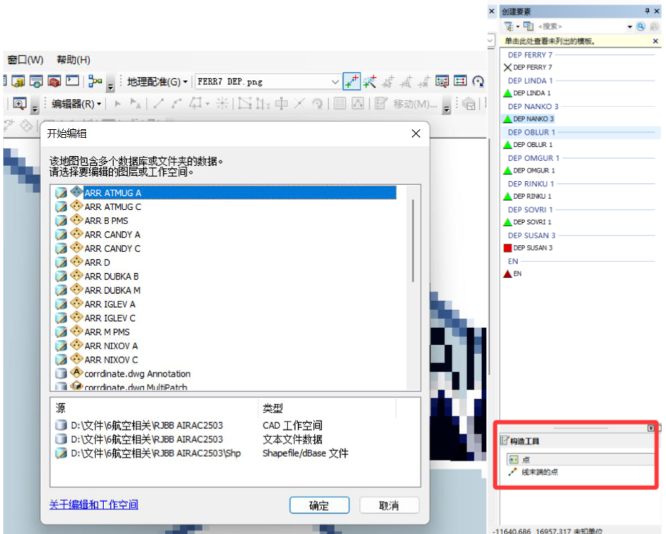
在编辑器中把程序经过的航点，用构造工具一个个点出来（虽然已经很节省时间了，但仍要花费不少时间）
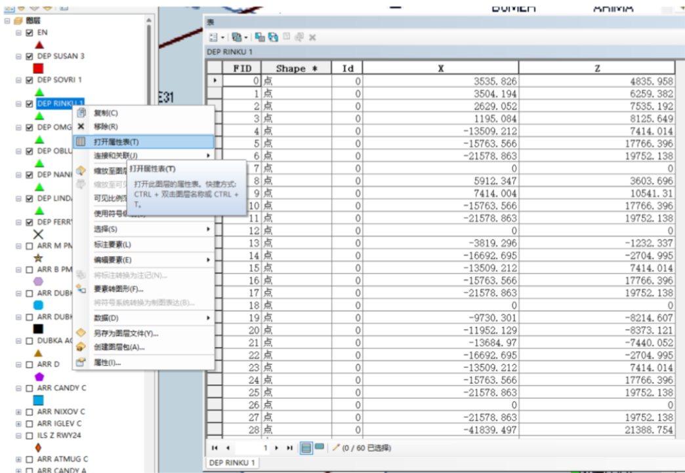
打开属性表，可以看到里边的坐标，复制下来粘贴到csv 中用Excel 编辑

然后就得到了[POINT]部分的内容
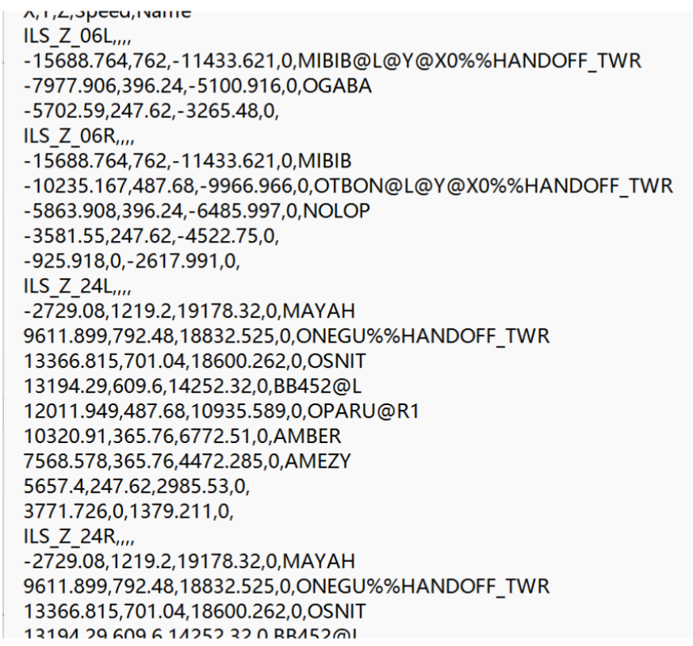
最后补全[HEADER]内的信息就成功做出航路了