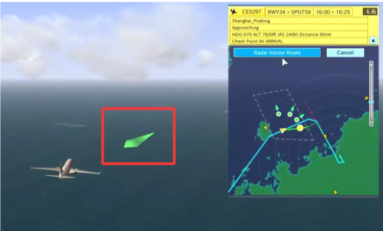

# 航路制作
## 航路文件相关
所有航路文件被放在```ATC4\PORT\ICAO\ROUTE```文件夹内
### aad
AA_RDR_xxx.aad 
雷达引导区 
AA_DIR_xxx.aad 
飞机飞进此区域后允许直飞某个点 
```ini
[HEADER]
name=AA_RDR_CREAM_PMS
x=139:46:52
z=35:33:12
staff=
comment=
count=5
[POINT]
30042.04,914.40,-7544.51,0,
50771.75,914.40,-50390.96,0,
69267.18,914.40,-41323.79,0,
44021.00,914.40,10245.25,0,
34406.99,914.40,5509.01,0,
```
```ini
[HEADER] 
Name：名字 
x,z：机场基准点ARP 经纬度坐标（度分秒） 
count：POINT 内坐标点的数量 
[POINT] 
X 坐标,箭头指向高度,Z 坐标,速度, 
X,Y,Z,Speed, 
...... 
按点的顺序围成一个多边形的雷达引导区 
坐标为相对ARP 的位置 
其中所有坐标和高度单位为m 
速度单位为kt
```

> 箭头指向高度和飞行无关，仅影响绿色箭头的指向

> FINAL

若雷达引导区直接引导至五边，则加上
这一条参数 
```
x,y,z,spd,   (相对远离跑道的点1) 
x,y,z,spd,    (相对靠近跑道的点2) 
```
就像这样(只负责演示，别直接复制粘贴)
```ini
[HEADER]
name=AA_RDR_SHINO
x=136:48:19
z=34:51:30
staff=
comment=
count=5
[FINAL]
-11096.00,1500.00,85778.00,0,
-27736,883.92,69877,0
[POINT]
-13104,914.4,84725,0,
-3643,914.4,65988,0,
-35251,914.4,45614,0,
-40088,914.4,52006,0,
-30641,914.4,772560,0,
```